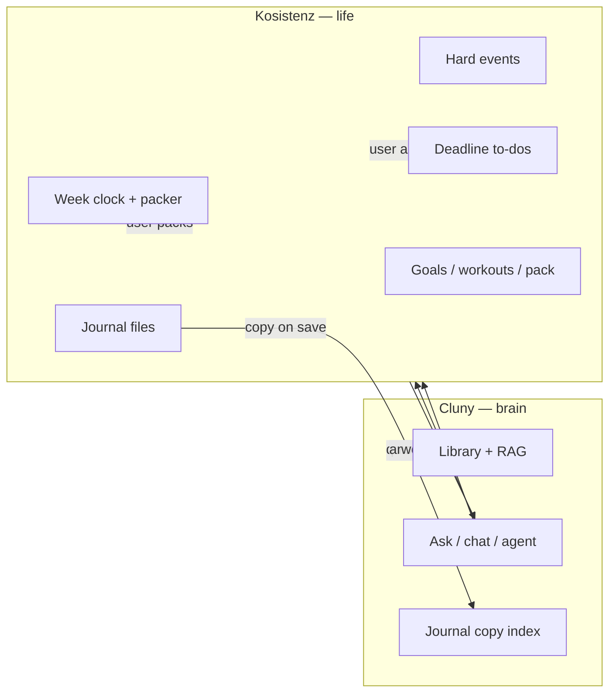

# Cluny ↔ Kosistenz integration

**Kosistenz is the life you live in. Cluny is the brain you ask.**

This document describes how **[Kosistenz](https://github.com/fresn3l/Kosistenz)** should call **Cluny** (`cluny serve`). If anything here disagrees with Kosistenz’s handoff doc, **the Kosistenz doc wins**:

**[`docs/cluny-integration.md`](https://github.com/fresn3l/Kosistenz/blob/main/docs/cluny-integration.md)** (see [Kosistenz PR #22](https://github.com/fresn3l/Kosistenz/pull/22)).

---

## Division of ownership

| Kosistenz owns (source of truth) | Cluny owns (brain) |
|----------------------------------|-------------------|
| Week clock | PDFs, notes, library catalog |
| Hard events (fixed on calendar) | Hybrid RAG (vector + FTS) |
| Deadline to-dos | Ask / chat / agent / planner reasoning |
| Which **day** you work something | Indexing a **copy** of journal text |
| Packer times (when things land on the clock) | Search across your second brain |
| Weekly goals | Work **proposals** (title, estimate, due, keyword) |
| Workouts | Citations and meeting prep from **notes** |
| Journal **files** (on disk) | CLI widget, full GUI, eval, backup |
| iPhone pack export | |

**Kosistenz must be fully usable with Cluny quit.** Scheduling, todos, calendar, goals, and journal editing live in Kosistenz.

**Cluny must not:**

- Maintain a second to-do list that Kosistenz treats as authoritative
- Own the live calendar event list for the app UI
- Choose **2:15 vs 2:40** (or any concrete clock slot)
- Run **Fill week** or otherwise place work on the week clock
- Override Kosistenz’s week clock, weekly goals, or iPhone pack

Cluny **may** suggest work items. Kosistenz decides whether to create them, which day they belong on, and when they get packed.

---

## Mental model



Kosistenz **pushes** journal text and **pulls** answers, snippets, and proposals. It does **not** treat Cluny’s `tasks.sqlite` or `calendar.sqlite` as the live schedule.

---

## Quick start

1. Install Cluny: `pip install -e ".[api]"` in [Cluny_the_AI_Agent](https://github.com/fresn3l/Cluny_the_AI_Agent).
2. Start Ollama (for embeddings and LLM routes).
3. Start the brain service:
   ```bash
   cluny serve
   ```
4. Default base URL: **`http://127.0.0.1:8787`**
5. On Kosistenz launch (optional): probe health and disable brain buttons if down:
   ```bash
   curl -s http://127.0.0.1:8787/health
   ```

If Cluny is down, Kosistenz still runs: week clock, todos, calendar, journal files, pack.

---

## Authentication

| Setting | Default |
|---------|---------|
| `CLUNY_API_BIND` | `127.0.0.1` |
| `CLUNY_API_PORT` | `8787` |
| `CLUNY_API_TOKEN` | empty |

If `CLUNY_API_TOKEN` is set, send `X-Cluny-Token: …` or `Authorization: Bearer …`. Non-localhost clients require a token.

---

## Endpoints Kosistenz should use

| Kosistenz need | Cluny endpoint | Notes |
|----------------|----------------|-------|
| Is brain up? | `GET /health` | `brain_ready` + `message`; disable Ask if false |
| Index journal on save | `POST /ingest/text` | **Copy** of entry; Kosistenz keeps canonical file |
| Search notes | `POST /search` | Retrieval only, no LLM |
| Ask (full response) | `POST /chat` | `context`, `context_json`, optional `session_id`; returns `sources` |
| Ask (streaming) | `POST /chat/stream` or `POST /ask` | SSE tokens + citations for typing indicator |
| Work proposals | `POST /propose` | Structured `{ title, estimate_minutes, due, keywords }[]` |
| Deep tool loop | `POST /agent` | Modes: `knowledge`, `planner`, etc. |
| Browse indexed docs | `GET /library` | Optional settings / debug UI |

### Journal copy (on save)

Kosistenz writes the journal file locally, then sends a copy for search:

```http
POST /ingest/text
Content-Type: application/json

{
  "text": "Today I worked on…",
  "catalog": true,
  "source": "kosistenz-journal",
  "title": "2026-09-01 journal",
  "collection": "journal"
}
```

Optional `collection` tags the document in Cluny's library (`journal`, `analytics`, etc.) for scoped RAG.

Requires Ollama for embedding. The on-disk journal in Kosistenz remains canonical; Cluny only indexes for RAG.

### Analytics snapshot (live context)

Send rolling or weekly analytics in `context_json` on `/chat` and `/propose`:

```json
{
  "date": "2026-09-01",
  "analytics": {
    "period": "2026-W35",
    "tasks_completed": 12,
    "tasks_slipped": 3,
    "focus_hours": 18.5,
    "journal_streak_days": 14,
    "goal_progress": [{ "goal": "Ship pack", "percent": 60 }]
  },
  "weekly_goals": ["Ship Kosistenz pack"]
}
```

For long-term trends, also ingest weekly rollup text:

```http
POST /ingest/text
{
  "text": "Weekly analytics 2026-W35\nTasks completed: 12\nTasks slipped: 3",
  "catalog": true,
  "source": "kosistenz-analytics",
  "title": "analytics-2026-W35",
  "collection": "analytics"
}
```

### Ask with Kosistenz context

Send Kosistenz state as free text (`context`), structured JSON (`context_json`), or both. Cluny merges them for reasoning; it does not read Kosistenz’s DB.

```http
POST /chat
{
  "question": "What should I prioritize before Friday?",
  "context_json": {
    "date": "2026-09-01",
    "deadline_todos": [{ "title": "Send agenda", "due": "2026-09-04" }],
    "events_today": [{ "title": "Product sync", "start": "14:00" }],
    "weekly_goals": ["Ship Kosistenz pack"]
  },
  "session_id": null
}
```

Response includes citations and a session id for follow-ups:

```json
{
  "route": "ask",
  "answer": "Focus on the agenda before Thursday…",
  "tool_calls": [],
  "sources": [
    { "label": "2026-08-28 journal", "snippet": "…", "doc_path": "…", "chunk_index": 2 }
  ],
  "session_id": "a1b2c3…"
}
```

Pass `session_id` on later messages in the same widget thread; Cluny stores history in `sessions.sqlite` (Kosistenz does not need to replay the full RAG state).

For a typing indicator, stream tokens:

```http
POST /chat/stream
Accept: text/event-stream
```

Same body as `/chat`. SSE events (each line `data: …`):

| Event | Payload |
|-------|---------|
| Meta | `{"route":"ask","session_id":"…"}` |
| Citations | `{"sources":[…]}` |
| Token | `{"token":" word"}` |
| Done | `[DONE]` |

`/ask` is an alias for `/chat/stream` (RAG-focused naming).

For meeting prep, include the meeting title and any deadlines; Cluny returns note snippets and suggestions—not a new calendar row.

```http
POST /agent
{
  "question": "Prep for Product sync Tuesday. Related open work: write agenda, review metrics.",
  "mode": "knowledge"
}
```

### Work proposals

`/propose` retrieves relevant journal/analytics chunks (RAG) and merges them with live `context_json` before suggesting work items.

```http
POST /propose
{
  "question": "What should I tackle before the product sync?",
  "context": "Open: write agenda (Thu). Meeting: Product sync Tue 2pm.",
  "context_json": {
    "analytics": { "tasks_slipped": 2, "period": "2026-W35" }
  },
  "collection": "journal"
}
```

```json
{
  "proposals": [
    {
      "title": "Draft agenda for Product sync",
      "estimate_minutes": 25,
      "due": "2026-09-04",
      "keywords": ["product", "agenda"]
    }
  ]
}
```

Kosistenz creates the real to-do, assigns the **day**, and runs the packer.

### Journal watch (optional)

Instead of push on every save, set `CLUNY_KOSISTENZ_JOURNAL_DIR` and run:

```bash
cluny watch-kosistenz-journal
```

Cluny indexes journal files from disk into its library (Kosistenz files remain canonical).

### Service at login

```bash
cluny serve-install
# remove: cluny serve-uninstall
```

---

## HTTP API surface

Kosistenz and other clients use **`cluny serve`** brain routes only:

| Method | Path | Purpose |
|--------|------|---------|
| `GET` | `/health` | Probe brain availability (`brain_ready`, `ollama_ok`) |
| `POST` | `/ingest/text` | Index journal copy on save |
| `POST` | `/search` | Retrieval only |
| `POST` | `/chat` | Supervisor-routed Ask (JSON, `sources`, `session_id`) |
| `POST` | `/chat/stream` | Streaming Ask (SSE) |
| `POST` | `/ask` | Alias for `/chat/stream` |
| `POST` | `/propose` | Work proposals from question + context |
| `POST` | `/agent` | Tool loop |
| `GET` | `/library` | Indexed documents (optional) |
| `GET` | `/brain/config` | Effective brain instructions (prompts + behavior) |
| `PUT` | `/brain/config` | Save `brain_config.json` overrides |
| `POST` | `/brain/config/reset` | Reset prompts/behavior/persona |

Task/calendar/context HTTP routes from Sprint 11 experiments were **removed** — Kosistenz owns those domains. Standalone Cluny still has `cluny tasks` and `cluny calendar` via CLI/widget.

---

## Health

```http
GET /health
```

```json
{
  "status": "ok",
  "brain_ready": true,
  "message": null,
  "ollama_ok": true,
  "doc_count": 42,
  "task_count": 7,
  "chunk_count": 1200
}
```

- `brain_ready` is false when Ollama is down; `message` explains why.
- `task_count` counts **Cluny’s local** `tasks.sqlite` (CLI/widget), not Kosistenz todos.
- If `ollama_ok` is false: Kosistenz still works; hide or disable ingest and LLM actions.
- OpenAPI: `http://127.0.0.1:8787/docs`

---

## Kosistenz widget (Ask panel)

Ship **`clients/kosistenz/ClunyBrainClient.swift`** into the Kosistenz app. It wraps the endpoints above for the in-app “Talk to Cluny” widget.

### Launch probe

On Kosistenz launch, call `GET /health`. If `brain_ready` is false, show the offline state and disable Ask / ingest buttons (week clock and journal still work).

### Non-streaming chat

```swift
let client = ClunyBrainClient(baseURL: URL(string: "http://127.0.0.1:8787")!)
let health = try await client.health()
guard health.brainReady else { /* show offline */ return }

var sessionId: String? = nil
let ctx = KosistenzContextPayload(
    date: "2026-09-01",
    deadlineTodos: [.init(title: "Send agenda", due: "2026-09-04")],
    eventsToday: [.init(title: "Product sync", start: "14:00")],
    weeklyGoals: ["Ship pack"]
)
let reply = try await client.chat(
    question: "What should I focus on today?",
    contextJSON: ctx,
    sessionId: sessionId
)
sessionId = reply.sessionId
// reply.sources → citation chips in the widget
```

### Streaming chat (typing indicator)

```swift
for try await event in client.chatStream(question: "Summarize my week", sessionId: sessionId) {
    switch event {
    case .meta(let route, let sid):
        sessionId = sid
    case .sources(let cites):
        showCitations(cites)
    case .token(let t):
        appendToAnswer(t)
    case .done:
        break
    }
}
```

### Work proposals

```swift
let proposals = try await client.propose(
    question: "Prep for product sync",
    contextJSON: ctx
)
// Kosistenz creates real todos and runs the packer — Cluny only proposes
```

### Context fields

| Field | Type | Purpose |
|-------|------|---------|
| `context` | string | Freeform Kosistenz snapshot |
| `context_json` | object | Structured: `date`, `deadline_todos`, `events_today`, `weekly_goals`, `analytics`, `notes` |
| `session_id` | string? | Omit on first message; pass back for multi-turn |
| `collection` | string? | Limit RAG to a named library collection (e.g. `journal`, `analytics`) |

Cluny merges `context` + `context_json` into the prompt. Prefer `context_json` for the widget — cleaner than string concatenation in Swift.

### Task mirror (optional)

Kosistenz owns authoritative todos and scheduling. Cluny can **mirror** todos by `external_id` so the tasks agent and local tools see the same open work — without Cluny picking days or clock slots.

```http
POST /tasks/sync
{
  "external_id": "kosistenz-todo-uuid",
  "title": "Send agenda",
  "status": "open",
  "due_at": "2026-09-04",
  "notes": "optional"
}
```

| Method | Path | Purpose |
|--------|------|---------|
| `POST` | `/tasks/sync` | Upsert mirror by `external_id` |
| `GET` | `/tasks/sync` | List all mirrored tasks |
| `GET` | `/tasks/sync/{external_id}` | Get one mirror |
| `DELETE` | `/tasks/sync/{external_id}` | Remove mirror when Kosistenz deletes the todo |

Push updates when Kosistenz todos change; delete the mirror when the real todo is removed. Cluny never schedules — it only reflects state for Ask/agent context.

### Errors

| Code | Meaning |
|------|---------|
| 404 | Unknown `session_id` — start a new session |
| 502 | Ollama unreachable |

---

## Swift client (reference)

Full implementation: **`clients/kosistenz/ClunyBrainClient.swift`**. Minimal sketch:

```swift
struct ClunyBrainClient {
    let base = URL(string: "http://127.0.0.1:8787")!
    var token: String?

    func health() async throws -> HealthResponse {
        var req = URLRequest(url: base.appendingPathComponent("health"))
        return try await decode(req)
    }

    /// After Kosistenz saves journal file to disk.
    func indexJournalCopy(text: String, title: String) async throws {
        var req = URLRequest(url: base.appendingPathComponent("ingest/text"))
        req.httpMethod = "POST"
        req.setValue("application/json", forHTTPHeaderField: "Content-Type")
        if let token { req.setValue(token, forHTTPHeaderField: "X-Cluny-Token") }
        req.httpBody = try JSONEncoder().encode([
            "text": text,
            "catalog": true,
            "source": "kosistenz-journal",
            "title": title
        ])
        _ = try await URLSession.shared.data(for: req)
    }

    func ask(_ question: String) async throws -> ChatResponse {
        var req = URLRequest(url: base.appendingPathComponent("chat"))
        req.httpMethod = "POST"
        req.setValue("application/json", forHTTPHeaderField: "Content-Type")
        if let token { req.setValue(token, forHTTPHeaderField: "X-Cluny-Token") }
        req.httpBody = try JSONEncoder().encode(["question": question])
        return try await decode(req)
    }
}
```

Kosistenz does **not** call `/tasks` from this client.

---

## Errors

| Code | Meaning |
|------|---------|
| 401 | Bad/missing token |
| 403 | Non-localhost without token |
| 404 | Resource not found |
| 502 | Ollama unreachable or model error |

---

## Service at login (optional)

See **Journal watch** and **`cluny serve-install`** above. Kosistenz does not depend on this.

---

## Data directories

| Data | Canonical location |
|------|-------------------|
| Journal files, week clock, todos, events, goals, pack | **Kosistenz** app data |
| PDFs, notes, vectors, FTS, library catalog | **Cluny** `CLUNY_DATA_DIR` (default `.cluny` next to Cluny repo) |
| Journal **search index** | Cluny (copy ingested from Kosistenz) |

Do not point Kosistenz at Cluny’s `tasks.sqlite` or `calendar.sqlite` for UI.

---

## Summary for implementers

1. **Kosistenz** = week clock, hard events, deadline todos, packing, goals, workouts, journal files, iPhone pack.
2. **Cluny** = RAG, Ask/chat/agent, journal **index copy**, work **proposals**.
3. Call **`/health`**, **`/ingest/text`**, **`/search`**, **`/chat`**, **`/ask`**, **`/agent`**.
4. Do **not** sync UI from Cluny `/tasks` or `/calendar`.
5. When in doubt, read **`docs/cluny-integration.md`** in the Kosistenz repo.
