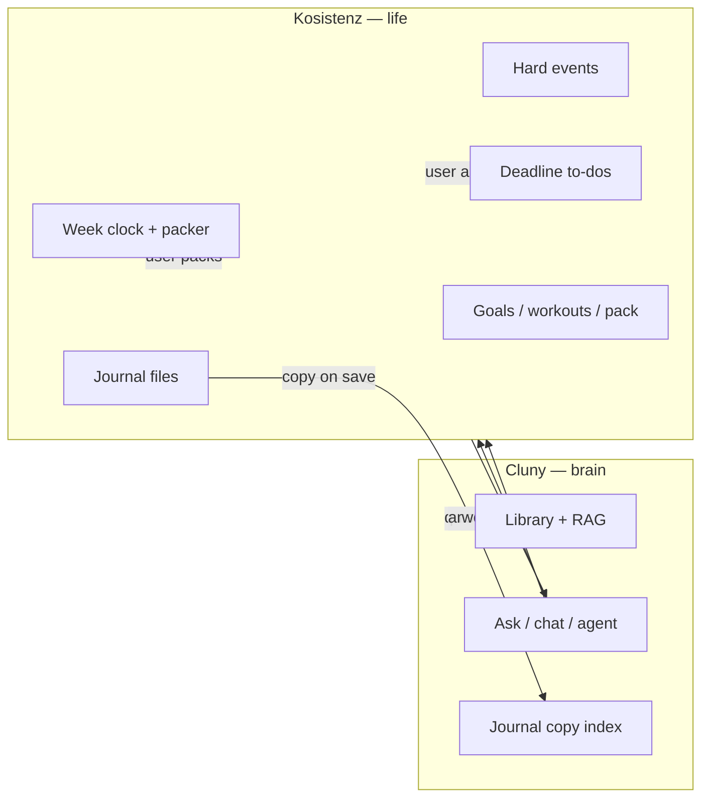

# Cluny ↔ Kosistenz integration

**Kosistenz is the life you live in. Cluny is the brain you ask.**

This document describes how **[Kosistenz](https://github.com/fresn3l/Kosistenz)** should call **Cluny** (`cluny serve`). If anything here disagrees with Kosistenz’s handoff doc, **the Kosistenz doc wins**:

**[`docs/cluny-integration.md`](https://github.com/fresn3l/Kosistenz/blob/main/docs/cluny-integration.md)** (see [Kosistenz PR #22](https://github.com/fresn3l/Kosistenz/pull/22)).

---

## Division of ownership

| Kosistenz owns (source of truth) | Cluny owns (brain) |
|----------------------------------|-------------------|
| Week clock | PDFs, notes, library catalog |
| Hard events (fixed on calendar) | Hybrid RAG (vector + FTS) |
| Deadline to-dos | Ask / chat / agent / planner reasoning |
| Which **day** you work something | Indexing a **copy** of journal text |
| Packer times (when things land on the clock) | Search across your second brain |
| Weekly goals | Work **proposals** (title, estimate, due, keyword) |
| Workouts | Citations and meeting prep from **notes** |
| Journal **files** (on disk) | CLI widget, full GUI, eval, backup |
| iPhone pack export | |

**Kosistenz must be fully usable with Cluny quit.** Scheduling, todos, calendar, goals, and journal editing live in Kosistenz.

**Cluny must not:**

- Maintain a second to-do list that Kosistenz treats as authoritative
- Own the live calendar event list for the app UI
- Choose **2:15 vs 2:40** (or any concrete clock slot)
- Run **Fill week** or otherwise place work on the week clock
- Override Kosistenz’s week clock, weekly goals, or iPhone pack

Cluny **may** suggest work items. Kosistenz decides whether to create them, which day they belong on, and when they get packed.

---

## Mental model



Kosistenz **pushes** journal text and **pulls** answers, snippets, and proposals. It does **not** treat Cluny’s `tasks.sqlite` or `calendar.sqlite` as the live schedule.

---

## Quick start

1. Install Cluny: `pip install -e ".[api]"` in [Cluny_the_AI_Agent](https://github.com/fresn3l/Cluny_the_AI_Agent).
2. Start Ollama (for embeddings and LLM routes).
3. Start the brain service:
   ```bash
   cluny serve
   ```
4. Default base URL: **`http://127.0.0.1:8787`**
5. On Kosistenz launch (optional): probe health and disable brain buttons if down:
   ```bash
   curl -s http://127.0.0.1:8787/health
   ```

If Cluny is down, Kosistenz still runs: week clock, todos, calendar, journal files, pack.

---

## Authentication

| Setting | Default |
|---------|---------|
| `CLUNY_API_BIND` | `127.0.0.1` |
| `CLUNY_API_PORT` | `8787` |
| `CLUNY_API_TOKEN` | empty |

If `CLUNY_API_TOKEN` is set, send `X-Cluny-Token: …` or `Authorization: Bearer …`. Non-localhost clients require a token.

---

## Endpoints Kosistenz should use

| Kosistenz need | Cluny endpoint | Notes |
|----------------|----------------|-------|
| Is brain up? | `GET /health` | Disable Ask / ingest if `ollama_ok` is false |
| Index journal on save | `POST /ingest/text` | **Copy** of entry; Kosistenz keeps canonical file |
| Search notes | `POST /search` | Retrieval only, no LLM |
| Ask / natural language | `POST /chat` | Supervisor routes intent |
| Streaming answer | `POST /ask` | SSE with citations |
| Deep tool loop | `POST /agent` | Modes: `knowledge`, `planner`, etc. |
| Browse indexed docs | `GET /library` | Optional settings / debug UI |

### Journal copy (on save)

Kosistenz writes the journal file locally, then sends a copy for search:

```http
POST /ingest/text
Content-Type: application/json

{
  "text": "Today I worked on…",
  "catalog": true,
  "source": "kosistenz-journal",
  "title": "2026-09-01 journal"
}
```

Requires Ollama for embedding. The on-disk journal in Kosistenz remains canonical; Cluny only indexes for RAG.

### Ask with Kosistenz context

Pass Kosistenz state **in the question** or in a future structured context field. Cluny uses it to reason; it does not read Kosistenz’s DB.

```http
POST /chat
{
  "question": "What should I prioritize before Friday? Open deadlines: send agenda (Thu), review PR (Fri). This week’s goal: ship Kosistenz pack."
}
```

For meeting prep, include the meeting title and any deadlines; Cluny returns note snippets and suggestions—not a new calendar row.

```http
POST /agent
{
  "question": "Prep for Product sync Tuesday. Related open work: write agenda, review metrics.",
  "mode": "knowledge"
}
```

### Work proposals (not Cluny tasks)

When Cluny suggests work, responses should be treated as **proposals** for Kosistenz to accept, edit, schedule, and pack—not as rows in Cluny’s task DB.

Example shape (from agent/planner output or a future dedicated route):

```json
{
  "proposals": [
    {
      "title": "Draft agenda for Product sync",
      "estimate_minutes": 25,
      "due": "2026-09-04",
      "keywords": ["product", "agenda"]
    }
  ]
}
```

Kosistenz creates the real to-do, assigns the **day**, and runs the packer. Cluny never assigns `14:15` vs `14:40`.

---

## Endpoints Kosistenz must not use as source of truth

These exist for **Cluny CLI, widget, and standalone use**. They are **not** the Kosistenz integration contract. Using them as the live todo/calendar list would duplicate Kosistenz and break the week clock, weekly goals, and iPhone pack.

| Endpoint | Status for Kosistenz |
|----------|----------------------|
| `GET/POST/PATCH/DELETE /tasks` | **Do not use** — Cluny local task store only |
| `GET /calendar/events`, `POST /calendar/import` | **Do not use** — Kosistenz owns events |
| `POST /context/day`, `POST /context/meeting` | **Misaligned** — built from Cluny SQLite, not Kosistenz; prefer `/chat` or `/agent` with Kosistenz-supplied context until a context API accepts Kosistenz payloads |

Sprint 11 shipped some of these routes for experimentation. **Kosistenz ignores them** per `docs/cluny-integration.md`.

---

## Health

```http
GET /health
```

```json
{
  "status": "ok",
  "ollama_ok": true,
  "doc_count": 42,
  "task_count": 7,
  "chunk_count": 1200
}
```

- `task_count` counts **Cluny’s local** `tasks.sqlite` (CLI/widget), not Kosistenz todos.
- If `ollama_ok` is false: Kosistenz still works; hide or disable ingest and LLM actions.
- OpenAPI: `http://127.0.0.1:8787/docs`

---

## Swift client sketch

```swift
struct ClunyBrainClient {
    let base = URL(string: "http://127.0.0.1:8787")!
    var token: String?

    func health() async throws -> HealthResponse {
        var req = URLRequest(url: base.appendingPathComponent("health"))
        return try await decode(req)
    }

    /// After Kosistenz saves journal file to disk.
    func indexJournalCopy(text: String, title: String) async throws {
        var req = URLRequest(url: base.appendingPathComponent("ingest/text"))
        req.httpMethod = "POST"
        req.setValue("application/json", forHTTPHeaderField: "Content-Type")
        if let token { req.setValue(token, forHTTPHeaderField: "X-Cluny-Token") }
        req.httpBody = try JSONEncoder().encode([
            "text": text,
            "catalog": true,
            "source": "kosistenz-journal",
            "title": title
        ])
        _ = try await URLSession.shared.data(for: req)
    }

    func ask(_ question: String) async throws -> ChatResponse {
        var req = URLRequest(url: base.appendingPathComponent("chat"))
        req.httpMethod = "POST"
        req.setValue("application/json", forHTTPHeaderField: "Content-Type")
        if let token { req.setValue(token, forHTTPHeaderField: "X-Cluny-Token") }
        req.httpBody = try JSONEncoder().encode(["question": question])
        return try await decode(req)
    }
}
```

Kosistenz does **not** call `/tasks` from this client.

---

## Errors

| Code | Meaning |
|------|---------|
| 401 | Bad/missing token |
| 403 | Non-localhost without token |
| 404 | Resource not found |
| 502 | Ollama unreachable or model error |

---

## Service at login (optional)

```bash
cp macos/com.cluny.serve.plist ~/Library/LaunchAgents/
# Edit ProgramArguments to your run_cluny.sh path
launchctl load ~/Library/LaunchAgents/com.cluny.serve.plist
```

Kosistenz does not depend on this; it only enables Ask/search when the user wants the brain.

---

## Data directories

| Data | Canonical location |
|------|-------------------|
| Journal files, week clock, todos, events, goals, pack | **Kosistenz** app data |
| PDFs, notes, vectors, FTS, library catalog | **Cluny** `CLUNY_DATA_DIR` (default `.cluny` next to Cluny repo) |
| Journal **search index** | Cluny (copy ingested from Kosistenz) |

Do not point Kosistenz at Cluny’s `tasks.sqlite` or `calendar.sqlite` for UI.

---

## Summary for implementers

1. **Kosistenz** = week clock, hard events, deadline todos, packing, goals, workouts, journal files, iPhone pack.
2. **Cluny** = RAG, Ask/chat/agent, journal **index copy**, work **proposals**.
3. Call **`/health`**, **`/ingest/text`**, **`/search`**, **`/chat`**, **`/ask`**, **`/agent`**.
4. Do **not** sync UI from Cluny `/tasks` or `/calendar`.
5. When in doubt, read **`docs/cluny-integration.md`** in the Kosistenz repo.
