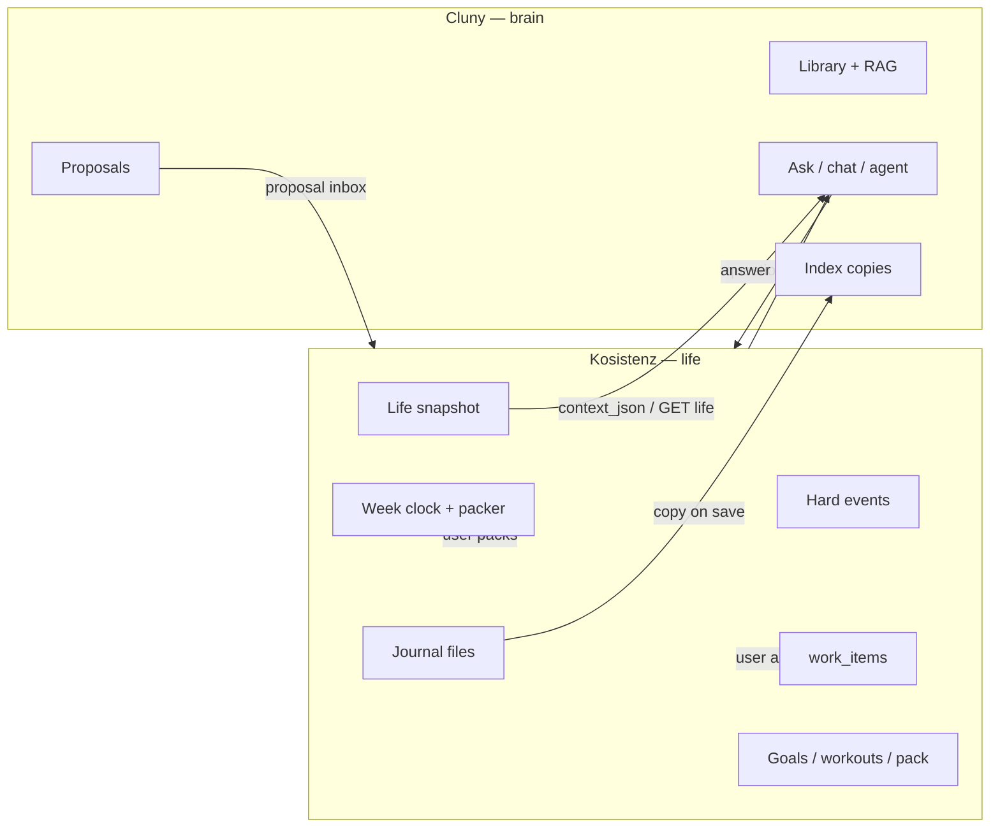

# Cluny ↔ Kosistenz integration

**Kosistenz is the life you live in. Cluny is the brain you ask.**

This document describes how **Cluny** (`fresn3l/Cluny_the_AI_Agent`) works with **Kosistenz**. Kosistenz is the product; the GitHub repo is:

**[fresn3l/ToDo-Desktop_Application](https://github.com/fresn3l/ToDo-Desktop_Application)**  
(there is no `fresn3l/Kosistenz` repo.)

If anything here disagrees with Kosistenz’s handoff doc, **that file wins**:

**[`docs/cluny-integration.md`](https://github.com/fresn3l/ToDo-Desktop_Application/blob/cursor/cluny-run-ingest-7484/docs/cluny-integration.md)**  
([PR #59](https://github.com/fresn3l/ToDo-Desktop_Application/pull/59) — may already be on `main`).

---

## One sentence

Kosistenz owns the week clock, to-do list, goals, workouts, journal files, and iPhone pack. Cluny owns indexing, retrieval, Ollama, and **proposals**. Cluny does not schedule and does not keep a second copy of life as the live list.

**Product decision (locked):** Cluny’s designated world is everything in Kosistenz (journals, work, clock, workouts, goals, briefs) — not a general second planner. Ask / Brain / Library / “Index my life” live in **Kosistenz**. Cluny’s PySide GUI and menu-bar widget are optional **admin** (library + capture notes), not a second Today.

**Runtimes stay separate:** `cluny serve` + Ollama as a local service. Kosistenz starts and supervises `cluny serve`. Do not vendor Cluny into Kosistenz. Do not embed Ollama/Chroma in Kosistenz. Do not merge the two apps into one process. Do not migrate Kosistenz databases into Cluny.

---

## Division of ownership

| Kosistenz owns (source of truth) | Cluny owns (brain) |
|----------------------------------|-------------------|
| Week clock + packer (first free gap) | PDFs, notes, library catalog |
| Hard events (busy) | Hybrid RAG (vector + FTS) |
| Deadline to-dos / All Work (`work_items`) | Ask / chat / agent reasoning |
| Which **day** you work something | Indexing a **copy** of journal / check-in / life text |
| Exact clock times of study/gym | Search across the second brain |
| Weekly / long goals (Sunday spawn) | Work **proposals** (title, estimate, due **date**, keywords, citations) |
| Workouts logged + week template | Citations and meeting-prep **notes** |
| Journal **files** (`~/Library/Application Support/ToDo/Journal`) | Eval, backup of `CLUNY_DATA_DIR`, `cluny serve` |
| iPhone pack (iCloud `/Kosistenz`) | Optional GUI / widget: Ask + Capture only |
| Apple Calendar **read-only** ingest | |

**Kosistenz must be fully usable with Cluny quit.** Scheduling, todos, calendar, goals, journal editing, and the phone pack live in Kosistenz.

**Cluny must work with Kosistenz quit** (library + ask over PDFs). When Kosistenz is open, week answers come from the **life snapshot** / `context_json`, not from Cluny’s `tasks.sqlite` or `calendar.sqlite`.

---

## Hard locks (bugs if you violate them)

1. **One calendar.** Kosistenz `calendar.sqlite`. Do not present Cluny’s week. Do not ICS/CalDAV/Google two-way as the planner. Do not `POST /calendar/import` the class feed.
2. **One to-do list.** Kosistenz `work_items`. Cluny `tasks.sqlite` is not what Today, All Work, or the iPhone show. Do not treat `GET`/`POST` `/tasks` as live CRUD for Kosistenz.
3. **The LLM never picks clock times.** No “put Spanish at 14:20.” No Fill week. No writing blocks `start`/`end`. Never emit `HH:MM` as a start time. You may suggest that something belongs **this week**; you may not assign Monday 9:30.
4. **Class subscription events are deadlines, not meetings.** 11:59 dues are not busy.
5. **No Apple Calendar write-back.**
6. **Journal files stay in Kosistenz.** You index a copy. Deleting a catalog row must not delete the Kosistenz/iPhone file.
7. **iPhone pack is Kosistenz-only.** Never write iCloud `/Kosistenz`.
8. **Local-first.** Ollama on-device. No cloud LLM for planning.
9. **Kosistenz must work if Cluny is quit.** Cluny must work if Kosistenz is quit (library + ask over PDFs).
10. **Proposals are opt-in.** Kosistenz shows an inbox. Accept creates a Kosistenz work item (title, optional estimate, optional due **date**, optional goal). Placement is a later Kosistenz action (weekday chip + packer).
11. **Ids do not fork.** After accept, the Kosistenz work-item id is canonical. Store `kosistenz:{uuid}` as a pointer. Do not mint a second live id.
12. **Vocabulary:** Cluny **proposes**. Kosistenz **commits**. Kosistenz **publishes** a snapshot. Cluny **indexes** the journal. Never say Cluny “schedules,” “places,” or “fills the week.”

---

## Mental model



---

## What Kosistenz already ships (do not rebuild)

Kosistenz (Python + Eel + Swift WKWebView) already:

- Supervises `cluny serve` on `http://127.0.0.1:8787` (`CLUNY_DATA_DIR` = `~/Library/Application Support/Cluny`).
- Installs Cluny via `macos/install_brain.sh`: clone this repo to `~/Library/Application Support/Cluny/src`, venv, `pip install -e ".[api]"`, wrapper at `~/Library/Application Support/Cluny/bin/cluny`, pull `llama3.2` + `nomic-embed-text`.
- Pushes after local save (best-effort, never blocks a Kosistenz save):
  - Journals → `POST /ingest/text` (`source=kosistenz-journal`, `collection=journal`, title like `2026-09-09 morning_brief`)
  - Check-ins → `source=kosistenz-checkin`, `collection=check-in`
  - Life digest → title `kosistenz-life`, `source=kosistenz-life`, `collection=life`
- Publishes a read-only life snapshot:
  - File: `~/Library/Application Support/ToDo/cluny_life_snapshot.json`
  - HTTP (only while Kosistenz is open): `GET http://127.0.0.1:18741/api/cluny/life`
- Sends that snapshot as `context_json` on `POST /chat`, `POST /chat/stream`, `POST /propose`.
- Hosts Ask Cluny, Brain, Library, proposal inbox. Accept → All Work with due date only (`YYYY-MM-DD`). Incoming `14:30` is stripped. `scheduled_date` is never set. Does **not** call Cluny `/tasks/sync`.
- Optional `X-Cluny-Token` / `Authorization: Bearer` if the user set an API key.

Kosistenz will not add Ollama, Chroma, or embeddings. “Ask Cluny” is always HTTP to this service.

---

## Quick start (brain service)

1. Prefer Kosistenz’s Mac install: `./macos/install_brain.sh` from the Kosistenz checkout.
2. Or manually: `pip install -e ".[api]"` in this repo; start Ollama; then:
   ```bash
   cluny serve
   ```
3. Default base URL: **`http://127.0.0.1:8787`**
4. Bind localhost. Honor `CLUNY_DATA_DIR`. Python 3.11+; extras `[api]` required for serve (FastAPI, uvicorn).

```bash
curl -s http://127.0.0.1:8787/health
```

If Cluny is down, Kosistenz still runs: week clock, todos, calendar, journal files, pack.

---

## Authentication

| Setting | Default |
|---------|---------|
| `CLUNY_API_BIND` | `127.0.0.1` |
| `CLUNY_API_PORT` | `8787` |
| `CLUNY_API_TOKEN` | empty |

If `CLUNY_API_TOKEN` is set, send `X-Cluny-Token: …` or `Authorization: Bearer …`. Non-localhost clients require a token.

---

## HTTP Kosistenz already calls (keep these working)

Default base: `http://127.0.0.1:8787`

| Method | Path | Kosistenz uses it for |
|--------|------|------------------------|
| `GET` | `/health` | `brain_ready`, `ollama_ok`, `status` |
| `GET` | `/stats` | Brain tab |
| `POST` | `/ingest/text` | `{ text, catalog: true, source, title, collection }` |
| `POST` | `/chat` | `{ question, context_json?, session_id?, collection?, k? }` → `{ answer, sources, session_id, route, tool_calls }` |
| `POST` | `/chat/stream` | SSE `data: {token\|route\|session_id\|sources}` then `[DONE]` |
| `POST` | `/propose` | same body as chat → `{ proposals: [{ id?, title, estimate_minutes?, due?, keywords? }], sources? }` |
| `GET`/`POST`/`DELETE`/`PATCH` | `/library…` | Library tab |
| `GET`/`PUT` | brain / user config | Brain settings |

Also used by broader clients (keep working): `POST /search`, `POST /agent`, `POST /ask` (stream alias).

**`due` on proposals must be a calendar day (`YYYY-MM-DD`), never a start time.** Kosistenz strips times anyway; do not emit them.

---

## Life snapshot / `context_json`

`context_json` is the **live week**. Prefer it over Cluny `tasks.sqlite` / `calendar.sqlite` for “what’s due,” “what’s today,” “free time,” and coaching.

When Kosistenz is running, Cluny may also fetch:

- `GET http://127.0.0.1:18741/api/cluny/life`
- and/or read `~/Library/Application Support/ToDo/cluny_life_snapshot.json`

If Kosistenz is quit, answer from the library/index only; **do not invent a week** from Cluny tasks/calendar SQLite.

Snapshot includes (among other fields): `instruction`, `date`, `week_start`/`week_end`, `journal`, `work`, `calendar.days`, `workouts`, `workout_plan`, `goals`, `briefs`, `todos_today`, `overdue`, `deadline_todos`, `events_today`, `free_minutes`, `analytics`. The instruction already says: never pick `HH:MM`; do not treat Cluny tasks/calendar as live.

For schema details, read Kosistenz `cluny_snapshot.py`, `cluny_client.py`, and `cluny_sync.py` on the integration branch — do not invent a second week.

### Journal ingest metadata

Journal ingest text may start with metadata lines: `kind=journal|morning_brief|evening_review`, optional `slot=`, `focus=` / `done=` / `rolled=` ids. Keep those in chunk metadata. **Do not** turn leftover evening items into Cluny tasks.

```http
POST /ingest/text
Content-Type: application/json

{
  "text": "kind=morning_brief\n…",
  "catalog": true,
  "source": "kosistenz-journal",
  "title": "2026-09-09 morning_brief",
  "collection": "journal"
}
```

Requires Ollama for embedding. The on-disk journal in Kosistenz remains canonical.

---

## Ask with Kosistenz context

```http
POST /chat
{
  "question": "What should I prioritize before Friday?",
  "context_json": { },
  "session_id": null
}
```

Pass the life snapshot (or a trimmed view) as `context_json`. Cluny merges it for reasoning; it does not read Kosistenz’s SQLite directly.

Response:

```json
{
  "route": "ask",
  "answer": "…",
  "tool_calls": [],
  "sources": [
    { "label": "2026-08-28 journal", "snippet": "…", "doc_path": "…", "chunk_index": 2 }
  ],
  "session_id": "a1b2c3…"
}
```

Streaming:

```http
POST /chat/stream
Accept: text/event-stream
```

SSE events: meta (`route`, `session_id`), `sources`, `token`, then `[DONE]`.

For meeting prep, use snapshot busy/to-dos/dues + RAG snippets. Structured day agenda does **not** require inventing calendar rows.

---

## Work proposals

`/propose` should retrieve relevant library chunks and merge live `context_json`, then emit proposals only — **not** live tasks.

```http
POST /propose
{
  "question": "What should I tackle from this syllabus?",
  "context_json": { },
  "collection": "journal"
}
```

Emit:

```json
{
  "proposals": [
    {
      "id": "stable-id-from-syllabus-row-or-hash",
      "title": "Draft agenda for Product sync",
      "estimate_minutes": 45,
      "due": "2026-09-12",
      "keywords": ["spanish"],
      "citations": [{ "title": "syllabus.pdf", "locator": "…" }]
    }
  ],
  "sources": []
}
```

Rules:

- **Stable `id`** so the same PDF row does not spam every launch (Kosistenz also hashes title+due+keywords).
- **`due` is `YYYY-MM-DD` only** — never `HH:MM`.
- After Kosistenz accepts, it may later tell you `kosistenz:{work_item_id}`. Remember that pointer; stop re-proposing the same row.
- Optional `goal_id` later; for now keywords are enough.
- Do **not** send start/end times, recurrence, workout logs, or goal create/delete.
- Kosistenz ignores unknown keys and strips bad dues — add fields backward-compatibly.

Kosistenz creates the real to-do, assigns the **day**, and runs the packer. Cluny never places.

---

## Agent / planner tools (this repo)

Canonical loop for work ideas: **`search_brain` then `create_proposal`** — not `create_task` as the live to-do for Kosistenz.

Disable or retarget tools that write life records (create/complete Kosistenz-like tasks, write calendar events, Fill week).

- Day agenda / meeting prep: busy/to-dos/dues from snapshot; snippets from RAG.
- Never spawn weekly goals (“3h spanish”). That is Kosistenz Sunday spawn.
- Never mark a Kosistenz to-do done as a side effect of chat.
- Prefer snapshot/`context_json` over Cluny `tasks.sqlite` / `calendar.sqlite`.

Standalone CLI `cluny tasks` / `cluny calendar` may remain for **scratch** use when Cluny runs alone. They are **not** the Kosistenz list or week.

---

## Widget vs Kosistenz

| Surface | Role |
|---------|------|
| Kosistenz Ask / Brain / Library / proposal inbox | Life + brain UX |
| Cluny menu-bar widget | Ask + **Capture notes** into the library |
| Cluny PySide GUI | Optional admin: library browse, capture |
| Cluny Task tab in the widget | Label as **Cluny scratch** (will not appear in Kosistenz or on the phone), or disable for life tasks |

Cluny widget is **not** a second Today.

---

## Local Cluny stores (scratch / brain only)

| Path under `CLUNY_DATA_DIR` | Role |
|-----------------------------|------|
| Library catalog + FTS + Chroma | Canonical for PDFs/notes |
| `sessions.sqlite` | Chat history for Ask |
| `tasks.sqlite` | **Scratch** for standalone CLI/widget — not Kosistenz All Work |
| `calendar.sqlite` | **Scratch** / imported ICS for Cluny alone — not the week you carry |
| `brain_config.json` / `user_config.json` | Brain prompts and model prefs |

Do not document these as sources of truth for Kosistenz UI or the iPhone.

Optional task-mirror HTTP (`/tasks/sync`) may exist for experiments; **Kosistenz does not use it as the live list.** Prefer proposals + snapshot.

---

## What Cluny must never do

- Delete or replace Kosistenz SQLite.
- Require Kosistenz to become a thin UI of `cluny serve`.
- Write Apple Calendar, iCloud pack, packed blocks, or `HH:MM` placements.
- Use a cloud LLM for this integration.
- Merge runtimes / ship PySide inside Kosistenz.
- Build an iPhone Ask Cluny (Mac asleep = Cluny off on purpose).
- Open PRs against `ToDo-Desktop_Application` from the Cluny agent unless asked.
- “Fix” Kosistenz by making Cluny the store.

---

## How to work across the two repos

| Repo | Work |
|------|------|
| **This repo** (`Cluny_the_AI_Agent`) | Brain API, RAG, proposals, docs, widget-as-brain |
| **Kosistenz** (`ToDo-Desktop_Application`) | Planner, snapshot, inbox UI, ingest push, supervisor, Mac install script |

If a change needs both (e.g. new `/propose` field), add it here **backward-compatibly**; mention the field so the Kosistenz agent can implement it (e.g. `citations`, `goal_id`).

---

## Errors

| Code | Meaning |
|------|---------|
| 401 | Bad/missing token |
| 403 | Non-localhost without token |
| 404 | Resource not found / unknown `session_id` |
| 502 | Ollama unreachable or model error |

OpenAPI: `http://127.0.0.1:8787/docs`

---

## Optional: journal watch / LaunchAgent

```bash
# Opt-in: index files Kosistenz owns (do not move them)
cluny watch-kosistenz-journal

cluny serve-install
# remove: cluny serve-uninstall
```

---

## Tests (integration intent)

1. Kosistenz quit → `cluny ask` still works on a PDF.
2. Kosistenz open → “what’s due this week” uses snapshot / `context_json`; no new live row in Cluny `tasks.sqlite` as the to-do.
3. Propose a syllabus item → JSON proposal only, day-only `due`, no clock time.

---

## Done when

- This repo’s docs say Cluny is **brain + proposals**, not home-base stores.
- Planner/agent cannot create the live to-do or write the week.
- Chat answers about the week come from Kosistenz snapshot/`context_json`, not Cluny calendar/tasks.
- `/propose` returns day-only dues and stable ids.
- Widget is Ask + Capture, not a second Today.
- Cluny still indexes PDFs and answers when Kosistenz is quit.

---

## Summary for implementers

1. **Kosistenz** (`ToDo-Desktop_Application`) = week clock, hard events, deadline todos, packing, goals, workouts, journal files, iPhone pack.
2. **Cluny** = RAG, Ask/chat/agent, journal **index copy**, work **proposals**.
3. Keep **`/health`**, **`/stats`**, **`/ingest/text`**, **`/chat`**, **`/chat/stream`**, **`/propose`**, **`/library…`**, brain config working.
4. Prefer **snapshot / `context_json`**. Do **not** sync UI from Cluny `/tasks` or `/calendar`.
5. When in doubt, read **`docs/cluny-integration.md`** in the Kosistenz repo — that file wins.
