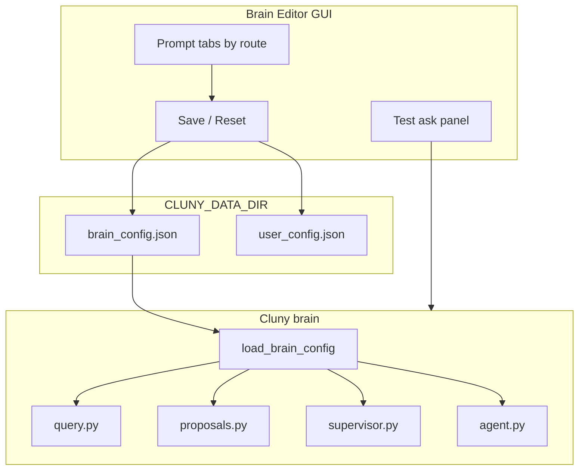

# Sprint 16 — Brain Editor GUI

**Goal:** A dedicated area in the Cluny desktop app where you can **directly edit how Cluny thinks** — system instructions, routing behavior, proposal rules, and retrieval settings — without touching Python source or `.env` by hand.

**Yes, this makes sense.** Today prompts are hardcoded across `query.py`, `proposals.py`, `supervisor.py`, and `agent.py`. You can tweak models and `k` in Settings, but not *what Cluny is told to do*. This sprint externalizes that into editable config and gives you a GUI to change it.

---

## Locked decisions

| Area | Choice |
|------|--------|
| Storage | `brain_config.json` under `CLUNY_DATA_DIR` (alongside `user_config.json`) |
| Defaults | Shipped in code; file overrides only fields you change |
| Scope | Full GUI (`cluny gui`) first; menu bar widget stays read-only |
| Apply | Changes take effect on **next** message (no hot-reload of running Ollama) |
| Safety | “Reset to defaults” per section + full reset; confirm dialog on save |
| Kosistenz boundary | Brain editor does **not** edit Kosistenz data; only Cluny’s reasoning layer |

---

## What you can edit (v1)

| Section | Maps to today | Example use |
|---------|---------------|-------------|
| **RAG / Ask** | `SYSTEM_PROMPT` + `RAG_USER_TEMPLATE` in `query.py` | “Be more concise”, “Always bullet answers” |
| **Propose** | `PROPOSE_SYSTEM` in `proposals.py` | “Prefer 3 proposals max”, “Never suggest meetings” |
| **Supervisor router** | `ROUTER_SYSTEM` in `supervisor.py` | Bias toward `ask` vs agent routes |
| **Agent modes** | `*_AGENT_SYSTEM` in `agent.py` | Task agent tone, planner aggressiveness |
| **Global persona** | New optional prefix prepended to all routes | “You are Cluny, Elijah’s local second brain…” |
| **Retrieval** | Already in `user_config` — surface here too | `k`, hybrid weight, rerank mode |
| **Models** | `user_config` chat/embed models | Same as Settings today, unified in Brain tab |

**Out of scope v1:** editing indexed document text, fine-tuning models, editing Kosistenz journal files, changing API routes.

---

## Architecture



### `brain_config.json` shape (draft)

```json
{
  "version": 1,
  "global_persona": "",
  "prompts": {
    "rag_system": null,
    "rag_user_template": null,
    "propose_system": null,
    "router_system": null,
    "knowledge_agent_system": null,
    "tasks_agent_system": null,
    "all_agent_system": null,
    "planner_agent_system": null
  },
  "behavior": {
    "supervisor_mode": "llm",
    "max_proposals": 5,
    "empty_index_message": null
  }
}
```

`null` = use built-in default from code. Non-null = override.

---

## Phases

### A — Config layer (backend)

- [x] `cluny/brain_config.py` — dataclass, `load_brain_config()`, `save_brain_config()`, `defaults()`
- [x] Refactor prompt sites to call `get_prompt("rag_system")` instead of module constants
- [x] Merge `global_persona` into system prompts at runtime
- [x] Tests: load/save roundtrip, null fields fall back to defaults, override wins

**Files touched:** `query.py`, `proposals.py`, `supervisor.py`, `agent.py`

### B — HTTP API (for packaged app + future remote editor)

- [ ] `GET /brain/config` — returns effective config (defaults merged with overrides)
- [ ] `PUT /brain/config` — validate + save `brain_config.json`
- [ ] `POST /brain/config/reset` — reset all or one key
- [ ] Tests in `tests/test_brain_config_api.py`

### C — GUI: Brain Editor window

- [ ] New menu: **Brain → Edit instructions…** (or dedicated **Brain** sidebar tab)
- [ ] **Prompt editor** — `QTextEdit` per route with label + “Reset section”
- [ ] **Behavior** panel — supervisor mode, max proposals, retrieval k / hybrid (reuse Settings fields)
- [ ] **Models** panel — chat + embed model (migrate from scattered Settings dialog)
- [ ] Save / Cancel / Reset all with confirmation
- [ ] Status line: “Changes apply to the next message”

**Entry:** extend `cluny/gui/main_window.py` or `cluny/gui/brain_editor.py`

### D — Live preview

- [ ] “Test this prompt” strip at bottom of Brain Editor
- [ ] Sample question dropdown (“Summarize my notes”, “What should I do tomorrow?”)
- [ ] Runs Ask **with current unsaved editor text** (does not persist until Save)
- [ ] Shows route + streamed answer in a small preview pane

### E — Polish + docs

- [ ] README section: Brain Editor
- [ ] Export/import `brain_config.json` (File → Export brain config…)
- [ ] Packaged app: Brain Editor works over HTTP brain (`CLUNY_BRAIN_URL`) via `/brain/config`

---

## UI sketch (single window)

```
┌─ Cluny — Brain Editor ─────────────────────────────────────┐
│ [RAG Ask] [Propose] [Router] [Agents ▾] [Behavior] [Models]│
├────────────────────────────────────────────────────────────┤
│ Global persona (prepended to all routes)                   │
│ ┌────────────────────────────────────────────────────────┐ │
│ │ You are Cluny, a local second brain…                   │ │
│ └────────────────────────────────────────────────────────┘ │
│                                                            │
│ RAG system prompt                                          │
│ ┌────────────────────────────────────────────────────────┐ │
│ │ You are Cluny, a local second-brain assistant…         │ │
│ │ …                                                      │ │
│ └────────────────────────────────────────────────────────┘ │
│                                                            │
│ ── Test preview ─────────────────────────────────────────  │
│ Question: [What patterns do you see in my journals?    ]   │
│ [Run preview]                                              │
│ ┌────────────────────────────────────────────────────────┐ │
│ │ (streamed answer appears here)                         │ │
│ └────────────────────────────────────────────────────────┘ │
│                                                            │
│              [Reset section]  [Cancel]  [Save brain config]  │
└────────────────────────────────────────────────────────────┘
```

---

## Test plan

```bash
.venv/bin/python -m pytest tests/test_brain_config.py tests/test_brain_config_api.py -q
CLUNY_USE_HTTP_BRAIN=1 cluny gui   # Brain → Edit instructions
# 1. Change RAG system prompt → Save
# 2. Ask in chat → verify new tone
# 3. Reset section → verify default behavior returns
```

---

## Risks & mitigations

| Risk | Mitigation |
|------|------------|
| User breaks JSON output on Propose route | Validate propose prompt still mentions JSON schema; show warning in UI |
| Prompt too long for context window | Character count + soft limit warning in editor |
| Packaged app edits wrong file | Always resolve path via `Settings.data_dir` / App Support |
| Drift between code defaults and saved file | `GET /brain/config` returns `effective` + `overrides` separately |

---

## Success criteria

1. You can open Brain Editor, change the RAG system prompt, save, and the next Ask in the chat window reflects it.
2. Propose route uses edited `propose_system` without code changes.
3. “Reset to defaults” restores shipped behavior.
4. Config survives app restart (`brain_config.json` in data dir).
5. 15+ new tests; full suite still green.

---

## After Sprint 16 (not this sprint)

See **`futurework.md`** for Kosistenz integration and standalone polish deferred from Sprint 15.

Possible Sprint 17+: prompt **versions** (history/undo), per-collection personas, eval harness tied to brain config snapshots.
