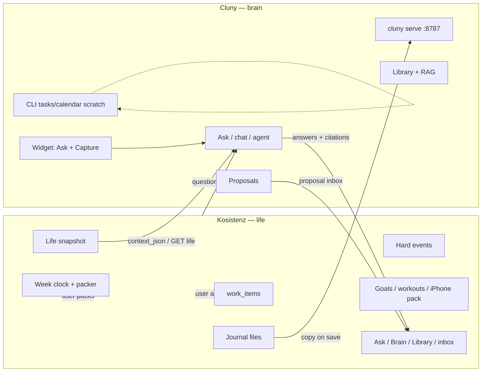
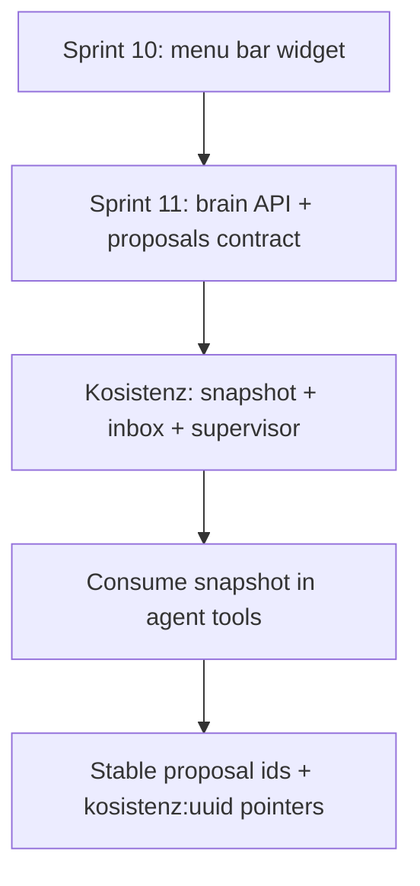

# Cluny — Sprint 11

**Theme:** *Kosistenz is the life you live in. Cluny is the brain you ask.*

Feature sprint after Sprint 10 (menu bar widget). Assumes [README.md](README.md) and [Agent_goals.md](Agent_goals.md).

**Authoritative integration doc (Kosistenz repo):**  
[`docs/cluny-integration.md`](https://github.com/fresn3l/ToDo-Desktop_Application/blob/cursor/cluny-run-ingest-7484/docs/cluny-integration.md)  
([PR #59](https://github.com/fresn3l/ToDo-Desktop_Application/pull/59)). **That file wins** where it disagrees with this sprint or earlier Cluny drafts.

**Cluny mirror:** [INTEGRATION.md](INTEGRATION.md) in this repo.

**Kosistenz repo:** [fresn3l/ToDo-Desktop_Application](https://github.com/fresn3l/ToDo-Desktop_Application) (product name Kosistenz; there is no `fresn3l/Kosistenz` repo).

---

## Platform architecture (corrected)

Earlier Sprint 11 drafts treated Cluny `tasks.sqlite` / `calendar.sqlite` as the source of truth and Kosistenz as a thin UI. **That is inverted.** Kosistenz already ships the planner and iPhone pack. Cluny is brain + proposals only.



| Kosistenz owns (source of truth) | Cluny owns |
|----------------------------------|------------|
| Week clock, packer times | PDFs, notes, library catalog |
| Hard events | Hybrid RAG |
| Deadline to-dos / All Work | Ask / chat / agent |
| Which **day** work lands on | Journal / check-in / life **index copy** |
| Weekly goals, workouts, iPhone pack | Work **proposals** (title, estimate, day-only due, keywords, citations) |
| Journal **files** | Optional GUI; widget Ask + Capture |
| Apple Calendar read-only ingest | Eval, backup, `cluny serve` |
| | CLI/widget `tasks.sqlite` / `calendar.sqlite` as **scratch only** |

**Kosistenz must work with Cluny quit.** Cluny must work with Kosistenz quit (library + ask over PDFs). Cluny must **not** pick 2:15 vs 2:40, run Fill week, write packed blocks, write Apple Calendar, write the iCloud pack, or act as a second authoritative todo/calendar list.

---

## Sprint 11 goals (Cluny side) — revised

1. Publish **`INTEGRATION.md`** aligned with Kosistenz `docs/cluny-integration.md` (this rewrite).
2. Document **brain + proposals** HTTP contract: `/health`, `/stats`, `/ingest/text`, `/search`, `/chat`, `/chat/stream`, `/propose`, `/library…`, brain config — **not** live task/calendar CRUD for Kosistenz.
3. Treat Cluny `tasks.sqlite` / `calendar.sqlite` as **scratch / standalone**, never as Kosistenz SoT. Prefer life snapshot / `context_json` for week questions.
4. Agent/planner: **`search_brain` → `create_proposal`**, not `create_task` as the canonical Kosistenz to-do. Disable or retarget tools that write life records / Fill week / clock times.
5. `/propose` emits stable ids and **`due` as `YYYY-MM-DD` only** (never `HH:MM`).
6. Widget = Ask + Capture notes; Task tab is scratch or disabled for life tasks — **not** a second Today.
7. Keep LaunchAgent / `cluny serve`, ingest, RAG, eval, backup of `CLUNY_DATA_DIR`.

**Out of scope:** Migrating Kosistenz DBs into Cluny. Making Kosistenz a thin UI of `cluny serve`. Vendoring Cluny into Kosistenz. Cloud LLM planning. iPhone Ask Cluny. Opening PRs on `ToDo-Desktop_Application` unless asked.

---

## What changed vs the inverted Sprint 11 draft

| Old Sprint 11 idea | Required |
|--------------------|----------|
| Task REST is live CRUD SoT | Optional proposal REST; live CRUD stays in Kosistenz |
| `external_id = kosistenz:{uuid}` | Keep — points **at Kosistenz ids** after accept |
| Calendar GET from Cluny DB | Read Kosistenz snapshot / `context_json`, or drop as the Kosistenz contract |
| `POST /calendar/import` for class ICS | Kosistenz already ingests ICS/EventKit. Do not duplicate |
| Journal canonical store is Cluny catalog | Kosistenz files + ingest **copy** |
| Kosistenz screens are HTTP clients of Cluny | Opposite: Cluny is the brain client of Kosistenz’s snapshot |
| Repo `fresn3l/Kosistenz` | `fresn3l/ToDo-Desktop_Application` |
| Handoff: “do not build a task schema in Kosistenz” | Opposite: Kosistenz schema already exists; do not replace it |

Brain-service work that **stays** valid: richer `/health`, localhost serve, ingest, search, chat, meeting-prep notes, LaunchAgent for `cluny serve`.

---

## Division of responsibility

| Concern | Kosistenz | Cluny |
|---------|-----------|-------|
| Week clock, Fill week, packer | ✓ | never |
| Hard events, deadline todos, All Work | ✓ | never (no live calendar/todo API for Kosistenz) |
| Journal files on disk | ✓ | index copy via `/ingest/text` |
| Life snapshot publish | ✓ | consume via `context_json` / optional GET `:18741` |
| Ask / Brain / Library / proposal inbox UX | ✓ | HTTP brain behind them |
| Ask / search / meeting prep from notes | calls `/chat`, `/search`, `/propose` | ✓ |
| Work proposals | inbox; user accepts | emit JSON proposals only |
| Sunday weekly-goal spawn | ✓ | never |
| Standalone CLI tasks/calendar | — | scratch only |
| Menu bar widget | life (todos/workout) | Ask + Capture notes |

---

## Deliverables

| Area | Status | Key files |
|------|--------|-----------|
| Integration doc (brain + proposals) | ✓ | `INTEGRATION.md` |
| Kosistenz handoff pointer | ✓ | `ToDo-Desktop_Application` `docs/cluny-integration.md` |
| Brain HTTP surface | ✓ | `cluny/api.py` |
| Library management HTTP | ✓ | `/library`, PATCH, collections, search |
| Proposals | ✓ / tighten | `/propose` — day-only dues, stable ids |
| Agent tools retarget | in progress | propose, not live create_task for Kosistenz |
| LaunchAgent | ✓ | `macos/com.cluny.serve.plist` |
| Tests | ✓ | `tests/test_api_integration.py`, `tests/test_gui_api.py` |

---

## API surface (Kosistenz uses these)

| Method | Path | Purpose |
|--------|------|---------|
| `GET` | `/health` | Probe brain; `brain_ready`, `ollama_ok` |
| `GET` | `/stats` | Brain tab |
| `POST` | `/ingest/text` | Index journal / check-in / life **copy** after Kosistenz save |
| `POST` | `/search` | Retrieval only |
| `POST` | `/chat` | Ask with optional `context_json` |
| `POST` | `/chat/stream` | Streaming Ask (SSE) |
| `POST` | `/propose` | Work proposals (day-only `due`, stable `id`) |
| `POST` | `/agent` | Tool loop — propose, do not place |
| `GET`/`PATCH`/`DELETE`… | `/library…` | Library tab |
| `GET`/`PUT` | brain / user config | Brain settings |

Pass the live week in **`context_json`** (snapshot). Prefer that over Cluny tasks/calendar SQLite.

Standalone Cluny task/calendar features use **CLI only** (`cluny tasks`, `cluny calendar`) as scratch — not HTTP live CRUD for Kosistenz.

---

## Example flows

### Journal save (Kosistenz canonical file → Cluny index copy)

```http
POST /ingest/text
{
  "text": "kind=journal\nToday I…",
  "catalog": true,
  "source": "kosistenz-journal",
  "title": "2026-09-09 journal",
  "collection": "journal"
}
```

### Ask with life snapshot

```http
POST /chat
{
  "question": "What's due this week?",
  "context_json": { }
}
```

Answer from snapshot + RAG. Do **not** create a live row in Cluny `tasks.sqlite` as the to-do.

### Work proposal (Kosistenz creates real todo + packs)

```http
POST /propose
{
  "question": "What should I pull from this syllabus?",
  "context_json": { }
}
```

```json
{
  "proposals": [
    {
      "id": "syllabus-row-hash",
      "title": "Essay outline",
      "estimate_minutes": 45,
      "due": "2026-09-12",
      "keywords": ["spanish"],
      "citations": [{ "title": "syllabus.pdf", "locator": "…" }]
    }
  ]
}
```

Kosistenz owns accept → All Work → day chip → packer. No `POST /tasks` from Kosistenz as live CRUD. No clock times in the proposal.

---

## Acceptance criteria

- `INTEGRATION.md` matches Kosistenz `docs/cluny-integration.md` intent (brain + proposals, not planner SoT).
- Kosistenz can use Cluny for health, ingest, search, chat, propose, library — **without** treating Cluny tasks/calendar as live.
- `/propose` does not emit `HH:MM` start times; dues are calendar days.
- Week Q&A prefers snapshot/`context_json`.
- Widget documented as Ask + Capture, not a second Today.
- CI green for API/integration tests.

---

## Handoff blurb (Kosistenz agent)

> Kosistenz (`ToDo-Desktop_Application`) owns week clock, events, `work_items`, journal files, goals, pack. Cluny is optional brain at `http://127.0.0.1:8787`. On save: `POST /ingest/text` with copies. For Ask: `POST /chat` with life snapshot as `context_json`. For suggestions: `POST /propose` → inbox; accept creates All Work with day-only due. **Do not** call Cluny `/tasks` or `/calendar` as live stores. See Kosistenz `docs/cluny-integration.md` (wins over Cluny drafts).

---

## Cross-sprint roadmap



Phases from the Kosistenz contract (ownership-shaped): Phase 0 freeze the split → Phase 1 brain ingest → Phase 2 read-only life context → Phase 3 proposal inbox → Phase 4 Ask inside Kosistenz → Phase 5 coaching, not control.

---

## Success definition

You live in **Kosistenz** every day — clock, todos, calendar, journal, pack — even when Cluny is off. When you want the second brain, **Cluny** answers from notes and may **propose** work; Kosistenz decides whether to accept and when it lands on the week. There is still **one** list and **one** clock.
