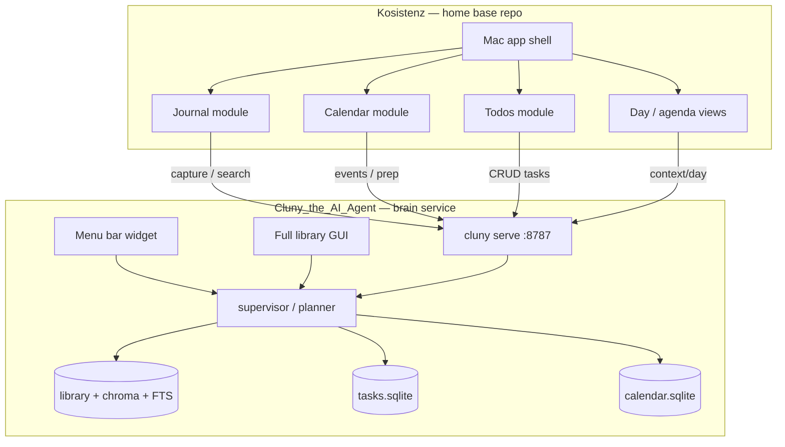
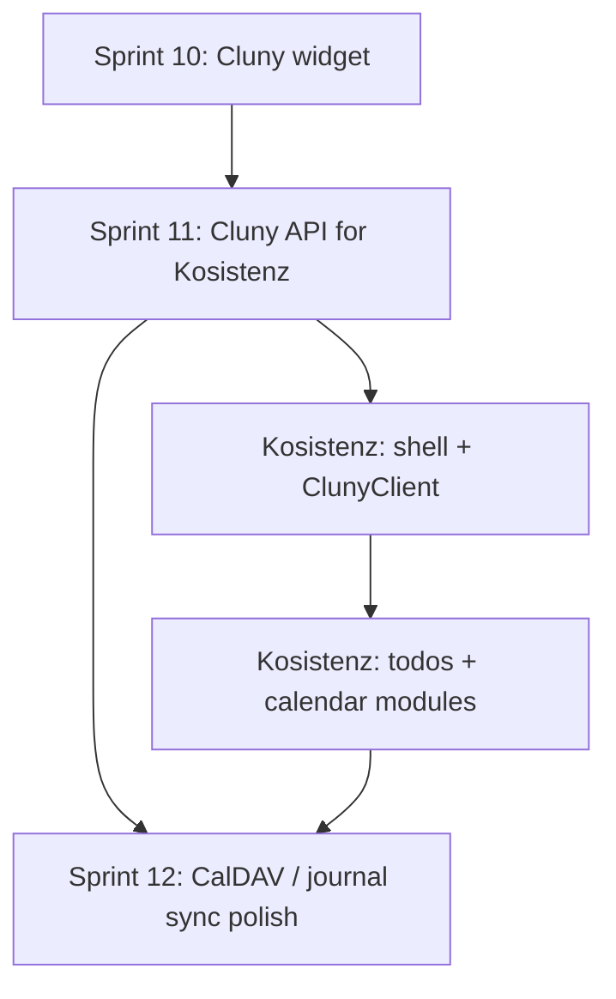

# Cluny — Sprint 11

**Theme:** *“Kosistenz is home base; Cluny is the brain behind it.”*

Feature-themed sprint following Sprint 10 (menu bar widget). Assumes the baseline in [README.md](README.md) and [Agent_goals.md](Agent_goals.md).

**Platform vision:** **[Kosistenz](https://github.com/fresn3l/Kosistenz)** (repo TBD / in progress) is the **primary Mac app** — journal, calendar, to-dos, and daily planning in one place. **Cluny** (this repo) is the **local intelligence + data layer**: indexed notes, hybrid RAG, agent routing, task store, calendar store, and HTTP API. Kosistenz does not reimplement a second brain; it calls Cluny.

**Guiding principle:** Kosistenz owns **product UX and module navigation**. Cluny owns **retrieval, reasoning, and durable stores**. Integration is **`cluny serve`** on localhost — not duplicated SQLite schemas or embed pipelines inside Kosistenz.

---

## Platform architecture



| Layer | Repo | Responsibility |
|-------|------|----------------|
| **Home base** | **Kosistenz** | Native Mac UI, journal/calendar/todo modules, notifications, navigation, local UI state |
| **Brain** | **Cluny_the_AI_Agent** | RAG, agents, tasks DB, calendar DB, ingest, eval, widget, optional deep library GUI |
| **Runtime** | Both on one Mac | Kosistenz → HTTP → Cluny; Ollama local; shared `CLUNY_DATA_DIR` or documented path |

**Cluny widget** remains a lightweight ambient entry (quick ask/capture) alongside the full Kosistenz app — not a replacement for it.

---

## Where you are after Sprint 10

**Cluny shipped:** menu bar widget, unified `Cluny.app`, supervisor, planner, hybrid RAG, task recurrence, ICS import, partial localhost API (`POST /tasks` only among task routes).

**Kosistenz:** home-base repo for journal + calendar + todos (built by separate agent/workstream). Not yet wired to Cluny API.

**Gaps:** no stable **integration contract**; incomplete task/calendar REST; no **context bundles** for day/meeting views; no **`external_id`** for Kosistenz ↔ Cluny row mapping; Kosistenz agent lacks a single doc to implement against.

---

## Sprint 11 goals (Cluny side)

1. Publish **`INTEGRATION.md`** targeted at **Kosistenz developers** (and the Kosistenz agent).
2. Expose **full task CRUD + list filters** over HTTP.
3. Expose **calendar read API** (+ optional ICS import trigger).
4. Add **context bundles** for Kosistenz day view and meeting prep.
5. Add **`external_id`** on tasks with namespace **`kosistenz:{uuid}`**.
6. Harden **service lifecycle** (health, LaunchAgent, auth docs).

**Out of scope for this repo in Sprint 11:** Kosistenz UI code — that ships in the Kosistenz repo consuming this API.

---

## Division of responsibility (Kosistenz vs Cluny)

| Concern | Kosistenz | Cluny |
|---------|-----------|-------|
| App shell, tabs, journal editor UX | ✓ | |
| Calendar month/week/day views | ✓ | |
| Todo lists, drag-drop, completion UX | ✓ | |
| macOS notifications presentation | ✓ | |
| Journal **content** persistence strategy | ✓ UI; index via Cluny | ✓ search index + optional catalog |
| Indexed notes, RAG, citations | calls API | ✓ |
| Supervisor / planner / `search_brain` | calls `/chat`, `/agent` | ✓ |
| Task **source of truth** | client | ✓ `tasks.sqlite` |
| Calendar event **source of truth** (v1) | client | ✓ `calendar.sqlite` |
| “Prep me for this meeting” | calls `/context/meeting` | ✓ |
| Batch ingest, backup, eval, CLI admin | — | ✓ |
| Menu bar quick capture widget | optional parallel | ✓ |

**Recommendation:** Kosistenz stores **UI state only** (selection, layout, draft text before save). On save, journal entries and tasks **flow through Cluny** (`/ingest/text`, `/tasks`) so widget, CLI, GUI, and Kosistenz stay aligned.

---

## Deliverables (Cluny repo)

| Area | Work | Key files |
|------|------|-----------|
| **Integration doc** | Kosistenz-focused contract: auth, base URL, modules → endpoints, Swift examples | new `INTEGRATION.md` |
| **Task REST** | Full CRUD + filters + `external_id` | [`cluny/api.py`](cluny/api.py), [`cluny/tasks_db.py`](cluny/tasks_db.py) |
| **Calendar REST** | `GET /calendar/events`, date filter, optional import | [`cluny/api.py`](cluny/api.py), [`cluny/calendar_db.py`](cluny/calendar_db.py) |
| **Context bundles** | `/context/day`, `/context/meeting` for Kosistenz agenda + prep screens | new `cluny/context.py` |
| **Journal bridge** | Document `/ingest/text` + `catalog: true` as Kosistenz journal save path | `INTEGRATION.md` |
| **API metadata** | Rich `GET /health` (`ollama_ok`, counts) | [`cluny/api.py`](cluny/api.py) |
| **Service lifecycle** | LaunchAgent template; note in README for Kosistenz launch probe | [`macos/`](macos/), README |
| **Tests** | `tests/test_api_integration.py` | new |
| **Cross-repo pointer** | Link from `INTEGRATION.md` → Kosistenz repo; Kosistenz README should link back | both repos |

---

## API surface (Sprint 11 target)

### Kosistenz module mapping

| Kosistenz module | Primary Cluny endpoints |
|------------------|-------------------------|
| **Todos** | `GET/POST/PATCH/DELETE /tasks`, `POST /tasks/{id}/complete` |
| **Calendar** | `GET /calendar/events`, `POST /context/meeting` |
| **Journal** | `POST /ingest/text` (`catalog: true`), `POST /search`, `POST /chat` |
| **Day view** | `POST /context/day`, `GET /tasks`, `GET /calendar/events` |
| **Ask Cluny** (any module) | `POST /chat` (supervisor default) |

### Tasks (full CRUD)

| Method | Path | Notes |
|--------|------|-------|
| `GET` | `/tasks` | `status`, `due_week`, `project_id`, `due_before`, `external_id` |
| `POST` | `/tasks` | include optional `external_id: "kosistenz:{uuid}"` |
| `GET` | `/tasks/{id}` | id or prefix |
| `PATCH` | `/tasks/{id}` | partial update |
| `POST` | `/tasks/{id}/complete` | |
| `DELETE` | `/tasks/{id}` | |

### Calendar (read-only v1)

| Method | Path | Notes |
|--------|------|-------|
| `GET` | `/calendar/events` | `limit`, `date` |
| `POST` | `/calendar/import` | local ICS path (Kosistenz export/sync staging) |

### Context (Kosistenz structured views)

| Method | Path | Purpose |
|--------|------|---------|
| `POST` | `/context/day` | `{ "date": "2026-09-01" }` → tasks + events + optional snippets |
| `POST` | `/context/meeting` | `{ "title", "date"? }` → prep bundle |

### Brain (existing)

`/health`, `/search`, `/ask`, `/chat`, `/agent`, `/ingest/text`, `/library`

---

## Example flows (Kosistenz)

### Day view (no LLM)

```http
POST /context/day
{ "date": "2026-09-01" }
```

Kosistenz renders unified agenda from response.

### Journal entry saved

```http
POST /ingest/text
{
  "text": "Today I…",
  "catalog": true,
  "source": "kosistenz-journal",
  "title": "2026-09-01 journal"
}
```

Entry becomes searchable across Kosistenz and Cluny widget.

### Todo checked off in Kosistenz

```http
POST /tasks/kosistenz:abc-123/complete
```
(or resolve by `GET /tasks?external_id=kosistenz:abc-123`)

### Meeting prep sheet

```http
POST /context/meeting
{ "title": "Product sync", "date": "2026-09-02" }
```

---

## Kosistenz repo expectations (parallel workstream)

These are **not** Cluny Sprint 11 code tasks but **dependencies** for the platform:

| Kosistenz deliverable | Depends on Cluny |
|----------------------|------------------|
| `ClunyClient` Swift module (or thin HTTP wrapper) | `INTEGRATION.md` |
| Todos screen | Task REST |
| Calendar screen | Calendar REST |
| Journal editor → save | `/ingest/text` |
| Launch: probe `GET /health`, show “Start Cluny” if down | `/health` |
| Settings: `CLUNY_API_URL`, optional token | auth docs |

**Repo layout suggestion (Kosistenz):**

```
Kosistenz/
  KosistenzApp/          # SwiftUI macOS shell
  Modules/
    Journal/
    Calendar/
    Todos/
  ClunyClient/           # HTTP client generated or hand-written from INTEGRATION.md
  README.md              # "Brain: Cluny_the_AI_Agent — see INTEGRATION.md"
```

---

## Acceptance criteria

- `INTEGRATION.md` names **Kosistenz** as the primary consumer and documents all module flows.
- Kosistenz (or curl harness) can manage tasks entirely via API.
- `external_id` with `kosistenz:` prefix round-trips.
- `/context/day` and `/context/meeting` return structured JSON for UI binding.
- CI green; no regression to widget/GUI/CLI.

---

## Open decisions

| Question | Options | Recommendation |
|----------|---------|----------------|
| Kosistenz ↔ Cluny packaging | Git submodule, sibling clone, Swift SPM binary | **Sibling repos** + documented `CLUNY_DATA_DIR`; submodule later if needed |
| Journal canonical store | Kosistenz files vs Cluny catalog only | **Cluny catalog** (`kind=journal` or inline) for v1; Kosistenz holds editor drafts only |
| Who starts `cluny serve` | Kosistenz launch, Cluny widget, LaunchAgent | **LaunchAgent** + Kosistenz health check |
| `external_id` format | `kosistenz:{uuid}` | **Locked** for Sprint 11 |
| Cluny widget vs Kosistenz | Both installed | **Both OK** — widget = ambient; Kosistenz = home |

---

## Cross-sprint roadmap



---

## Success definition

**Kosistenz** is the app you open daily for journal, calendar, and todos. **Cluny** runs invisibly as the brain: one task store, one calendar store, one searchable note index. The Cluny widget remains for quick capture; **`cluny gui`** remains for deep library work. No duplicate brains, no sync conflicts between two todo databases.

---

## Handoff blurb for the Kosistenz agent

> **Kosistenz** is the home-base Mac app (journal, calendar, todos). Do **not** build RAG, embeddings, or a separate task/calendar SQLite schema. Call **Cluny** at `http://127.0.0.1:8787` (see `INTEGRATION.md` in [Cluny_the_AI_Agent](https://github.com/fresn3l/Cluny_the_AI_Agent)). On launch, `GET /health`. Todos → `/tasks`. Calendar → `/calendar/events` and `/context/meeting`. Journal save → `POST /ingest/text` with `catalog: true`. Natural language → `POST /chat`. Use `external_id: "kosistenz:{uuid}"` on tasks you create.

---

## Suggested implementation order (Cluny repo)

1. `INTEGRATION.md` (Kosistenz-first).
2. Task REST CRUD + `external_id`.
3. Calendar GET + tests.
4. `cluny/context.py` + context endpoints.
5. Rich `/health` + LaunchAgent template.
6. README + Agent_goals pointer to Kosistenz platform vision.
