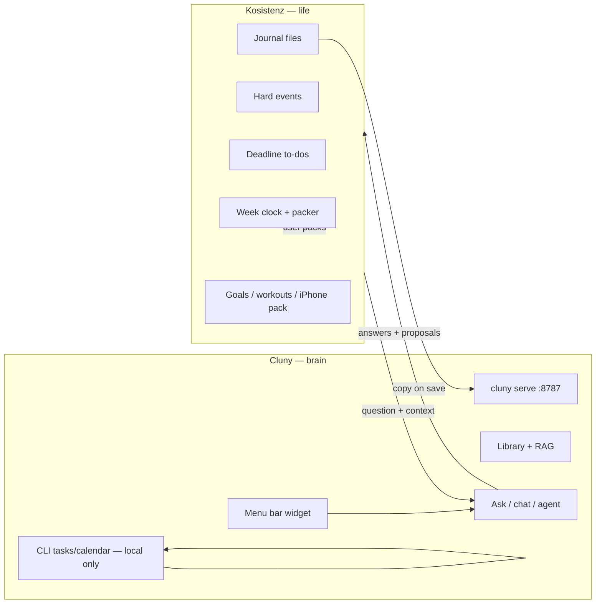
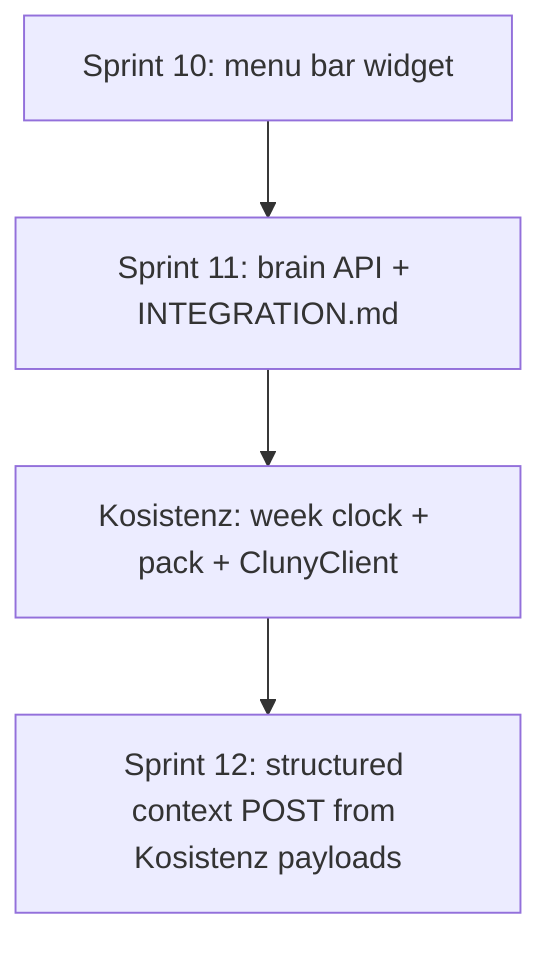

# Cluny — Sprint 11

**Theme:** *Kosistenz is the life you live in. Cluny is the brain you ask.*

Feature sprint after Sprint 10 (menu bar widget). Assumes [README.md](README.md) and [Agent_goals.md](Agent_goals.md).

**Authoritative integration doc (Kosistenz repo):** [`docs/cluny-integration.md`](https://github.com/fresn3l/Kosistenz/blob/main/docs/cluny-integration.md) — [PR #22](https://github.com/fresn3l/Kosistenz/pull/22). **That file wins** where it disagrees with earlier Cluny drafts.

**Cluny mirror:** [INTEGRATION.md](INTEGRATION.md) in this repo.

---

## Platform architecture (corrected)



| Kosistenz owns (source of truth) | Cluny owns |
|----------------------------------|------------|
| Week clock, packer times | PDFs, notes, library catalog |
| Hard events | Hybrid RAG |
| Deadline to-dos | Ask / chat / agent |
| Which **day** work lands on | Journal **index copy** |
| Weekly goals, workouts | Work **proposals** (title, estimate, due, keyword) |
| Journal **files** | CLI/widget local `tasks.sqlite` / `calendar.sqlite` |
| iPhone pack | Eval, backup, full GUI |

**Kosistenz must work with Cluny quit.** Cluny must **not** pick 2:15 vs 2:40, run Fill week, or act as a second authoritative todo/calendar list.

---

## Sprint 11 goals (Cluny side)

1. Publish **`INTEGRATION.md`** aligned with Kosistenz `docs/cluny-integration.md`.
2. Document **brain-only** HTTP contract: `/health`, `/ingest/text`, `/search`, `/chat`, `/ask`, `/agent`, `/library`.
3. **Deprecate** misaligned Sprint 11 experiment routes (`/tasks`, `/calendar`, `/context`) — CLI/widget only, OpenAPI `deprecated`, `Deprecation` headers.
4. Rich **`GET /health`** with `integration: brain-only` and local task count disclaimer.
5. **LaunchAgent** template + README pointer.
6. Tests split: **`test_api_integration.py`** (Kosistenz brain) vs **`test_api_legacy.py`** (deprecated routes).

**Out of scope:** Kosistenz UI (separate repo). Removing CLI `cluny tasks` / `cluny calendar` — those remain for standalone Cluny use.

---

## Division of responsibility

| Concern | Kosistenz | Cluny |
|---------|-----------|-------|
| Week clock, Fill week, packer | ✓ | never |
| Hard events, deadline todos | ✓ | never (no live calendar/todo API for Kosistenz) |
| Journal files on disk | ✓ | index copy via `/ingest/text` |
| Ask / search / meeting prep from notes | calls `/chat`, `/search`, `/agent` | ✓ |
| Work proposals | receives proposals; user accepts | may suggest via agent/planner |
| Standalone CLI tasks/calendar | — | ✓ local SQLite + deprecated HTTP |
| Menu bar widget | optional parallel | ✓ |

---

## Deliverables

| Area | Status | Key files |
|------|--------|-----------|
| Integration doc (brain-only) | ✓ | `INTEGRATION.md` |
| Kosistenz handoff pointer | ✓ | links to `docs/cluny-integration.md` |
| Brain HTTP surface | ✓ | `cluny/api.py` |
| Legacy HTTP routes removed | ✓ | `/tasks`, `/calendar`, `/context` dropped from API |
| LaunchAgent | ✓ | `macos/com.cluny.serve.plist` |
| Tests | ✓ | `tests/test_api_integration.py` |

---

## API surface

### Kosistenz (use these)

| Method | Path | Purpose |
|--------|------|---------|
| `GET` | `/health` | Probe brain; `integration: brain-only` |
| `POST` | `/ingest/text` | Index journal **copy** after Kosistenz save |
| `POST` | `/search` | Retrieval only |
| `POST` | `/chat` | Supervisor-routed Ask |
| `POST` | `/ask` | Streaming RAG (SSE) |
| `POST` | `/agent` | Tool loop (`knowledge`, `planner`, …) |
| `GET` | `/library` | Indexed documents (optional UI) |

Pass Kosistenz state (deadlines, goals, meeting title) **in the question** until a structured context API exists.

Standalone Cluny task/calendar features use **CLI only** (`cluny tasks`, `cluny calendar`) — not HTTP.

## Example flows

### Journal save (Kosistenz canonical file → Cluny index copy)

```http
POST /ingest/text
{
  "text": "Today I…",
  "catalog": true,
  "source": "kosistenz-journal",
  "title": "2026-09-01 journal"
}
```

### Ask with Kosistenz context in the message

```http
POST /chat
{
  "question": "Prep for Product sync Tuesday. Open deadlines: agenda (Thu), metrics (Fri)."
}
```

### Work proposal (Kosistenz creates real todo + packs)

Cluny agent/planner may return suggestions; Kosistenz owns creation and scheduling. No `POST /tasks` from Kosistenz.

---

## Acceptance criteria

- `INTEGRATION.md` matches Kosistenz `docs/cluny-integration.md` intent.
- Kosistenz can use Cluny for health, ingest, search, chat — **without** task/calendar HTTP.
- Legacy task/calendar HTTP routes removed; CLI paths unchanged.
- CI green.

---

## Handoff blurb (Kosistenz agent)

> Kosistenz owns week clock, events, todos, journal files, goals, pack. Cluny is optional brain at `http://127.0.0.1:8787`. On save: `POST /ingest/text` with journal copy. For Ask: `POST /chat` with your deadlines/goals in the question. **Do not** call `/tasks` or `/calendar`. See Kosistenz `docs/cluny-integration.md`.

---

## Cross-sprint roadmap



---

## Success definition

You live in **Kosistenz** every day — clock, todos, calendar, journal, pack — even when Cluny is off. When you want the second brain, **Cluny** answers from notes and may propose work; Kosistenz decides when and where it lands on the week.
