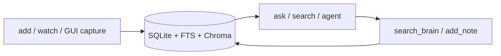
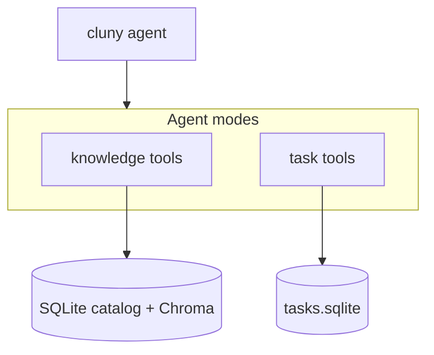
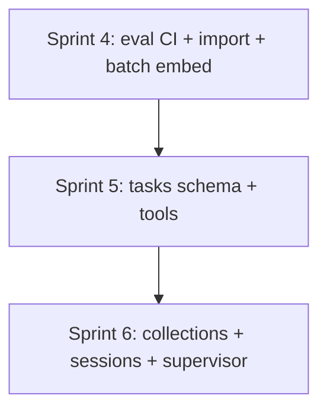

# Cluny — Sprints 4–6

Feature-themed sprints following the completion of Sprints 1–3 (reliability, hybrid retrieval, tags/GUI/agent). Assumes the baseline in [README.md](README.md) and [Agent_goals.md](Agent_goals.md).

**Guiding principle:** harden and measure the second brain until eval is green on *your* content, then add **task tools** as a separate namespace (Agent_goals Option C) before calendar/finance verticals.

---

## Where you are after Sprint 3

**Shipped:** catalog CRUD, content-hash skip, hybrid RRF retrieval, streaming, tags, export, eval harness, minimal agent loop, PySide6 library panel.

**Gaps to close next:** restore/import, eval in CI, ingest performance, collections UX, task vertical, conversation memory, optional reranking.

---

## Sprint 4 — Quality gate and ops completeness

**Theme:** *“I can trust the numbers and move data safely.”*

### Goals

- Make `cluny eval` a real regression gate on your indexed library.
- Close the backup loop (export exists; import/restore does not).
- Remove the biggest ingest bottleneck (sequential embed calls).

### Deliverables

| Area | Work | Key files |
|------|------|-----------|
| **Import / restore** | `cluny import <archive.zip>` — extract to `CLUNY_DATA_DIR` with `--merge` flag; document in README | [`cluny/backup.py`](cluny/backup.py), [`cluny/cli.py`](cluny/cli.py) |
| **Eval CI** | GitHub Action: `pytest` + `cluny eval --retrieval-only` on PRs; optional nightly full eval if Ollama available | `.github/workflows/ci.yml` |
| **Eval metrics** | Report retrieval hit rate, refusal rate, latency per case; `eval/reports/` convention | [`cluny/eval.py`](cluny/eval.py) |
| **Batch embed** | `OllamaClient.embed_batch()`; ingest embeds chunks in batches (configurable size) | [`cluny/ollama_client.py`](cluny/ollama_client.py), [`cluny/ingest.py`](cluny/ingest.py) |
| **Per-type chunking** | Env or metadata-driven chunk sizes: PDF vs markdown vs journal | [`cluny/chunking.py`](cluny/chunking.py), [`cluny/documents.py`](cluny/documents.py) |
| **Golden set hygiene** | Replace seed questions in [`eval/golden.yaml`](eval/golden.yaml) with 8–10 cases from your real index | `eval/golden.yaml` |
| **Optional rerank** | `CLUNY_RERANK=off\|llm` — LLM scores top-20 RRF hits down to k (no new deps) | [`cluny/query.py`](cluny/query.py) |

### Acceptance criteria

- `cluny import backup.zip` restores a working index after `export`.
- Ingesting a 50-chunk doc uses batched embed (fewer HTTP round-trips than chunk count).
- `cluny eval --retrieval-only` passes in CI without Ollama chat.
- Custom golden set committed; you rerun after pipeline changes.

### Learning focus

- **Eval design:** retrieval-only vs end-to-end; what to automate in CI without GPU.
- **Performance:** batching vs latency tradeoffs for local Ollama.

---

## Sprint 5 — Task storage and tools (Option C)

**Theme:** *“Cluny remembers what I need to do — separately from what I know.”*

### Goals

- Add a **tasks** vertical with its own SQLite schema and CLI — no mixing with RAG retrieval yet.
- Extend the agent with a **task tool namespace**, gated by mode.

### Deliverables

| Area | Work | Key files |
|------|------|-----------|
| **Tasks schema** | `tasks` table: id, title, status, due_at, created_at, notes, project_id (nullable) | new `cluny/tasks_db.py` |
| **Tasks CLI** | `cluny tasks add/list/show/complete/update/delete` | [`cluny/cli.py`](cluny/cli.py) |
| **Task tools** | `create_task`, `list_tasks`, `update_task`, `complete_task` — SQLite only, no shell | new `cluny/tools/tasks.py` |
| **Agent modes** | `cluny agent --mode knowledge\|tasks\|all`; registry loads subset; prompt scopes tools | [`cluny/agent.py`](cluny/agent.py), [`cluny/cli.py`](cluny/cli.py) |
| **GUI toggle** | Agent mode dropdown: Ask / Knowledge agent / Tasks agent | [`cluny/gui/main_window.py`](cluny/gui/main_window.py) |
| **Tests** | CRUD + tool executor tests (no Ollama) | `tests/test_tasks.py` |

### Architecture

### Guardrails

- Task tools never read/write Chroma or document files.
- `complete_task` and `delete_task` require explicit user intent in agent mode (system prompt).
- No calendar sync in this sprint — dates are stored strings/ISO only.

### Acceptance criteria

- `cluny tasks add "Buy milk" --due tomorrow` appears in `cluny tasks list`.
- `cluny agent --mode tasks "What's due this week?"` calls `list_tasks` and answers from DB.
- `cluny agent --mode knowledge` cannot invoke task tools.
- `pytest` covers task CRUD.

### Learning focus

- **Tool namespaces:** why separating knowledge vs task tools reduces misuse.
- **Schema design:** tasks as a vertical slice before external integrations.

---

## Sprint 6 — Organization depth and daily-driver UX

**Theme:** *“Cluny feels like my notebook, not a demo.”*

### Goals

- Move beyond flat tags to **collections/notebooks** and dedup UX.
- Make the GUI usable daily without editing `.env`.
- Lay groundwork for a future **supervisor** (one chat, multiple backends).

### Deliverables

| Area | Work | Key files |
|------|------|-----------|
| **Collections** | `collections` + `document_collections`; CLI `cluny collection create/add/list`; filter search/retrieve | [`cluny/library_db.py`](cluny/library_db.py), [`cluny/cli.py`](cluny/cli.py) |
| **Dedup / replace** | `cluny add --replace` finds by content_hash or title; `cluny library dedup` report | [`cluny/documents.py`](cluny/documents.py) |
| **Conversation memory** | SQLite `sessions` + `messages`; GUI persists chat per session; `cluny ask --session` | new `cluny/sessions.py`, GUI |
| **Settings UI** | GUI panel or dialog for model names, k, hybrid weight (writes to user config, not repo `.env`) | [`cluny/gui/`](cluny/gui/), new `cluny/user_config.py` |
| **Source navigation** | GUI: click source → open file path or show full chunk | [`cluny/gui/main_window.py`](cluny/gui/main_window.py) |
| **Supervisor stub** | `cluny chat` entrypoint that classifies intent → `ask`, `agent --mode tasks`, or `agent --mode knowledge` | new `cluny/supervisor.py` |
| **Calendar slice (optional)** | `cluny calendar import file.ics` → read-only events table; no agent tools yet | new `cluny/calendar_db.py` |

### Acceptance criteria

- Documents belong to a collection; `cluny search "…" --collection research` scopes retrieval.
- GUI reopens last conversation after restart.
- Duplicate ingest with same hash offers replace/skip clearly.
- Supervisor routes “what’s on my calendar” vs “what did Smith say” to different backends (stub OK if calendar import deferred).

### Learning focus

- **Memory layers revisited:** session chat vs catalog vs vectors vs tasks DB.
- **Supervisor pattern:** intent routing without a single overloaded tool list.

---

## Cross-sprint dependencies

- Sprint 5 should not start until Sprint 4 golden eval is meaningful on your data.
- Sprint 6 **supervisor** depends on Sprint 5 task tools existing as a routable backend.

---

## Explicitly out of scope (Sprints 7+)

- Multi-device sync, encryption at rest, cloud LLM providers.
- Google Calendar / CalDAV two-way sync.
- Cross-encoder model deps (use LLM rerank in Sprint 4 first).
- Full finance/health verticals.

---

## Success definition (end of Sprint 6)

Cluny is a **daily local assistant**: measurable RAG quality, safe data round-trip (export/import), organized library with collections, persistent chat, task tracking via explicit tools, and a supervisor entrypoint that routes questions to the right subsystem — ready for calendar integration or sync in a later phase.
