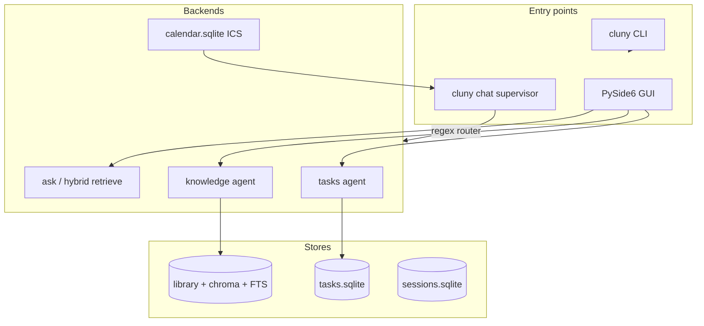
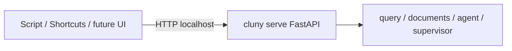
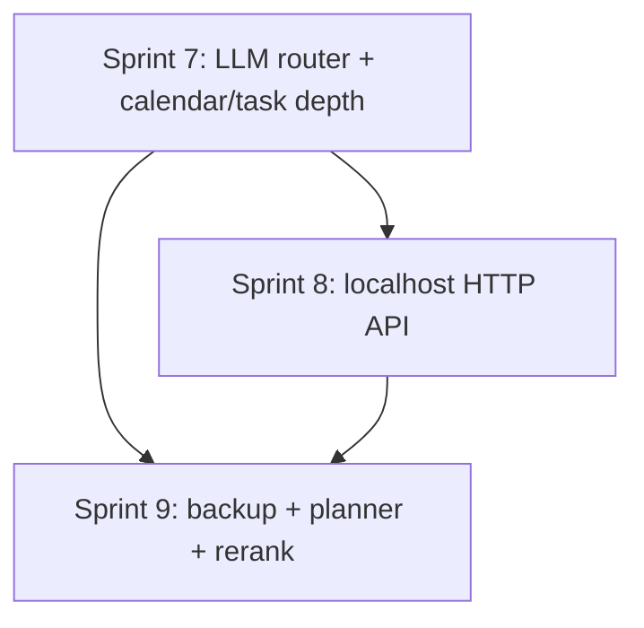

# Cluny — Sprints 7–9

Feature-themed sprints following Sprints 4–6 (import/eval CI, tasks, collections/supervisor). Assumes the baseline in [README.md](README.md) and [Agent_goals.md](Agent_goals.md).

**Guiding principle:** deepen the **unified chat** experience and expose Cluny as a **local API** you can customize — still local-first, no cloud LLM required. Defer multi-device sync and finance/health until the daily loop is solid.

---

## Where you are after Sprint 6

**Shipped:** hybrid RAG, eval CI, tasks CRUD + tools, collections, sessions, export/import, regex supervisor, ICS import, GUI settings.

**Gaps to close next:** supervisor is brittle; calendar has no agent tools; `user_config.json` does not override runtime models; no HTTP API for customization; tasks lack recurrence/smart dates; eval not yet tied to *your* indexed library; orphan `ingest-text` chunks.

---

## Sprint 7 — Smart routing and vertical depth

**Theme:** *“One chat entrypoint that reliably picks the right subsystem.”*

### Goals

- Replace regex-only supervisor with a **small LLM router** (fallback to keywords).
- Give calendar and tasks enough depth for daily use.
- Make GUI settings actually affect runtime behavior.

### Deliverables

| Area | Work | Key files |
|------|------|-----------|
| **LLM supervisor** | `classify_intent_llm()` with short prompt; fallback to regex in [`supervisor.py`](cluny/supervisor.py); `CLUNY_SUPERVISOR=llm\|regex` | [`cluny/supervisor.py`](cluny/supervisor.py), [`cluny/config.py`](cluny/config.py) |
| **Calendar tools** | `list_events`, `events_on_date` (read-only) for agent `--mode all` | [`cluny/tools/calendar.py`](cluny/tools/calendar.py), [`cluny/agent.py`](cluny/agent.py) |
| **Task dates** | Parse `--due` (tomorrow, +3d, ISO) via `dateutil` or stdlib; `list_tasks --due-before` / `--due-week` | [`cluny/tasks_db.py`](cluny/tasks_db.py), [`cluny/cli.py`](cluny/cli.py) |
| **Projects** | Use existing `project_id`; `cluny tasks list --project X`; filter in `list_tasks` tool | [`cluny/tasks_db.py`](cluny/tasks_db.py) |
| **Settings overlay** | `Settings.with_user_config()` merges `user_config.json` over env for models, k, hybrid weight | [`cluny/config.py`](cluny/config.py), [`cluny/user_config.py`](cluny/user_config.py) |
| **GUI supervisor** | Add “Chat (auto)” mode using `run_chat()`; show route badge on replies | [`cluny/gui/main_window.py`](cluny/gui/main_window.py) |
| **Eval on real index** | Document `eval/golden-local.yaml` (gitignored template); `cluny eval -g golden-local.yaml` | [`eval/golden-local.example.yaml`](eval/golden-local.example.yaml), [README](README.md) |
| **ingest-text catalog** | Optional `--catalog` flag registers inline captures as `kind=inline` docs | [`cluny/cli.py`](cluny/cli.py), [`cluny/ingest.py`](cluny/ingest.py) |

### Acceptance criteria

- `cluny chat "meetings Thursday"` routes to calendar when ICS events exist.
- `cluny tasks add "Report" --due tomorrow` stores a parseable ISO `due_at`.
- GUI Chat mode shows `[route: tasks_agent]` (or similar) on responses.
- Changing chat model in GUI settings affects the next `ask`/`agent` call without editing `.env`.

### Learning focus

- **Router design:** keyword vs LLM classification; when fallback matters.
- **Vertical slices:** read-only calendar tools before CalDAV sync.

---

## Sprint 8 — Local HTTP API (customization surface)

**Theme:** *“Cluny is a service I can script and extend.”*

Aligns with Agent_goals: *“coded and customizable, so API + custom code.”*

### Goals

- Expose core operations over **localhost HTTP** without changing the CLI/GUI code paths.
- Enable streaming and automation (scripts, Shortcuts, future mobile capture).

### Deliverables

| Area | Work | Key files |
|------|------|-----------|
| **HTTP server** | `cluny serve` — bind `127.0.0.1`, port from `CLUNY_API_PORT` (default 8787) | new `cluny/api.py`, [`cluny/cli.py`](cluny/cli.py) |
| **Framework** | FastAPI + uvicorn as optional dep `[api]` | [`pyproject.toml`](pyproject.toml) |
| **Endpoints** | `GET /health`, `POST /search`, `POST /ask` (SSE stream), `POST /ingest/text`, `GET /library`, `POST /tasks`, `POST /agent`, `POST /chat` | [`cluny/api.py`](cluny/api.py) |
| **Auth** | Optional `CLUNY_API_TOKEN`; reject non-localhost unless token set | [`cluny/config.py`](cluny/config.py) |
| **Shared core** | All handlers call existing `retrieve`, `rag_answer_stream`, `add_file`, `run_agent`, `run_chat` — no duplicate logic | existing modules |
| **OpenAPI** | Auto docs at `/docs` for learning and client generation | FastAPI default |
| **Tests** | `TestClient` tests for `/health`, `/search` (mock Ollama), auth rejection | `tests/test_api.py` |

### Architecture

### Acceptance criteria

- `curl -X POST localhost:8787/search -d '{"query":"memory","k":3}'` returns JSON chunks.
- `POST /ask` streams tokens via SSE.
- API tests pass without a running Ollama instance (mocked embed/chat).
- CLI and GUI behavior unchanged when API is not running.

### Learning focus

- **API vs CLI:** same domain logic, different transport.
- **Streaming over HTTP:** SSE vs WebSocket tradeoff for local tools.

### Deferred

- Public exposure beyond localhost (intentionally out of scope).
- Full REST CRUD for every catalog field.

---

## Sprint 9 — Ops, planner mode, and retrieval polish

**Theme:** *“Safe to rely on daily; quality stops drifting.”*

### Goals

- Close the ops loop: scheduled backups and optional encrypted exports.
- Add a **planner** mode that orchestrates brain + tasks in one agent session.
- Push retrieval quality if LLM rerank plateaus.

### Deliverables

| Area | Work | Key files |
|------|------|-----------|
| **Scheduled backup** | `cluny backup run` writes timestamped zip to `CLUNY_BACKUP_DIR`; document cron example | [`cluny/backup.py`](cluny/backup.py), [`cluny/cli.py`](cluny/cli.py) |
| **Encrypted export** | `cluny export --password` (zip AES via `pyzipper` or stdlib + docs for gpg) | [`cluny/backup.py`](cluny/backup.py) |
| **Planner mode** | `cluny agent --mode planner` — system prompt allows knowledge then task tools in sequence; max turns 12 | [`cluny/agent.py`](cluny/agent.py) |
| **Supervisor upgrade** | Planner route for compound questions (“summarize X and add a task to…”); uses `--mode all` agent | [`cluny/supervisor.py`](cluny/supervisor.py) |
| **Task recurrence** | `recurrence` column (simple: daily/weekly/monthly + anchor); `cluny tasks add --every week` | [`cluny/tasks_db.py`](cluny/tasks_db.py) |
| **Cross-encoder rerank** | Optional `CLUNY_RERANK=cross` with `sentence-transformers` cross-encoder (opt dep `[rerank]`) | [`cluny/query.py`](cluny/query.py) |
| **Eval gate** | CI runs `pytest`; optional workflow job `eval-full` with Ollama service + golden-local artifact | [`.github/workflows/ci.yml`](.github/workflows/ci.yml) |
| **Stale goals doc** | Update [Agent_goals.md](Agent_goals.md) baseline to reflect Sprints 1–6 reality | [Agent_goals.md](Agent_goals.md) |

### Acceptance criteria

- `cluny backup run` produces `backups/cluny-YYYY-MM-DD.zip` restorable via `cluny import`.
- `cluny agent --mode planner "Read my notes on Smith and create a task to email him"` calls `search_brain` then `create_task`.
- Recurring task appears in `cluny tasks list` with recurrence metadata.
- With `[rerank]` installed, `CLUNY_RERANK=cross` changes retrieval order on exact-term golden cases.

### Learning focus

- **Planner vs supervisor:** orchestration inside one LLM session vs routing between backends.
- **Ops for local apps:** backup cadence, encrypted archives, restore drills.

### Explicitly out of scope (Sprints 10+)

- Multi-device sync (Syncthing/git-based manifest only as future spike).
- Google Calendar / CalDAV two-way sync.
- Cloud LLM providers (OpenAI/Anthropic).
- Finance / health verticals.
- Native mobile app (API from Sprint 8 is the integration point).

---

## Cross-sprint dependencies

- Sprint 8 **API** should call Sprint 7 **settings overlay** and **supervisor** for `/chat`.
- Sprint 9 **planner** builds on Sprint 7 calendar tools and task date parsing.
- Sprint 9 **eval-full** CI benefits from Sprint 7 **golden-local** workflow.

---

## Open decisions (fill in before Sprint 7)

| Question | Options | Recommendation |
|----------|---------|----------------|
| API framework | FastAPI vs stdlib `http.server` | FastAPI — OpenAPI + SSE; optional dep keeps core lean |
| Due date parsing | `dateutil` vs hand-rolled | `python-dateutil` — one dep, better learning ROI |
| Encrypted export | `pyzipper` vs document `gpg` only | `pyzipper` optional dep — simpler UX |
| Primary UI next year | CLI / GUI / API clients | Keep GUI + add API; defer local web UI unless API is insufficient |

---

## Success definition (end of Sprint 9)

Cluny is a **local platform**: one smart chat entrypoint, scriptable HTTP API, dependable backups, planner orchestration across brain + tasks + calendar, and measurable retrieval quality — ready for sync integrations or new verticals without re-architecting core stores.
